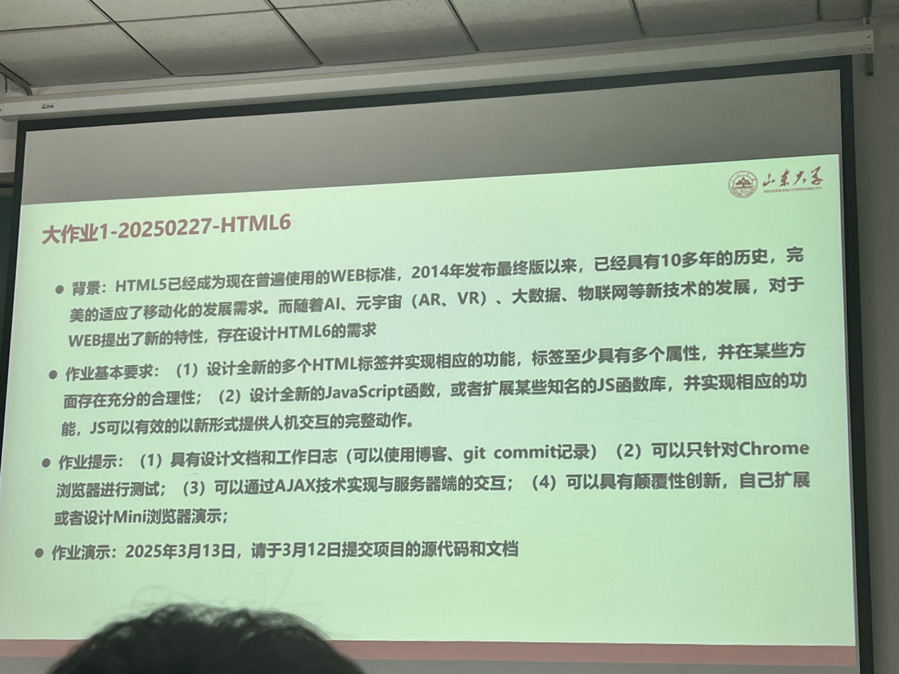
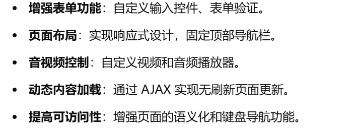
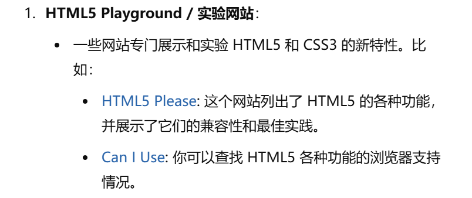
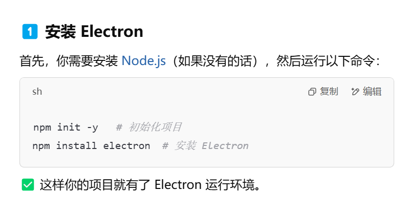
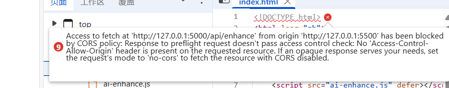
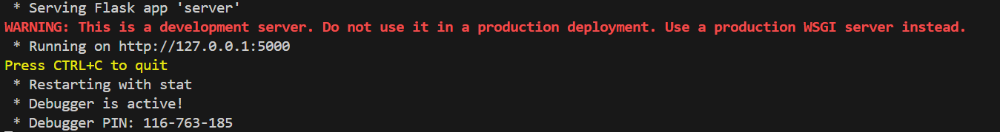
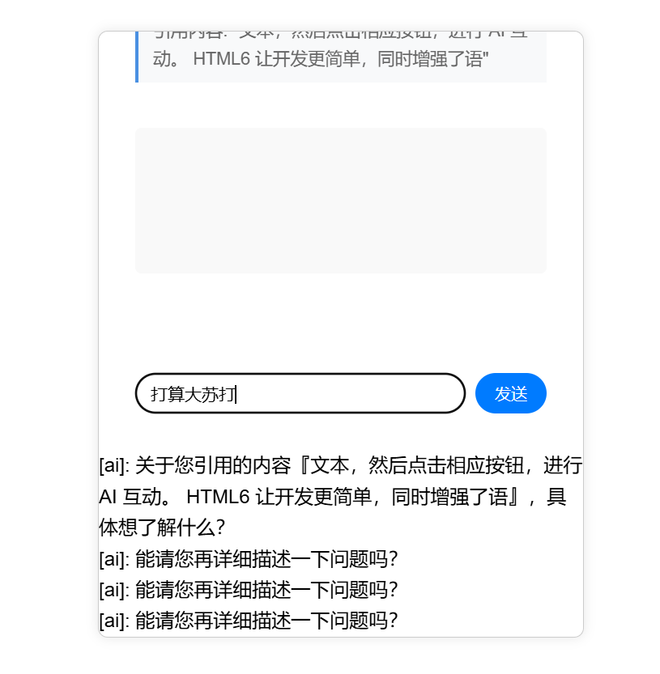
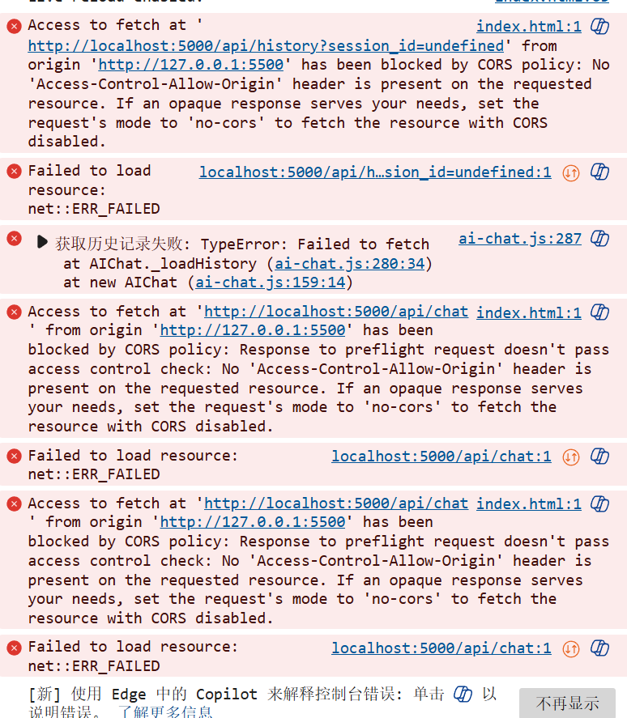
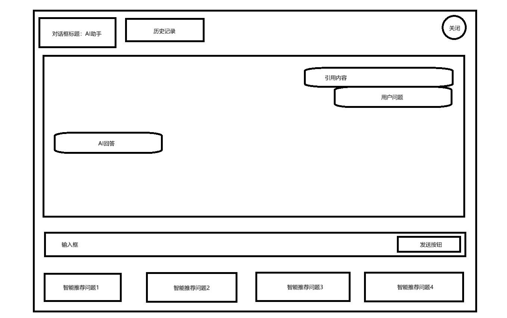

# HTML6标签创新设计工作日志

## 2025.02.27——2025.02.28

高级程序设计课布置了大作业，要求如图

于是去询问 AI ，有哪些方面可以做，决定花一两天时间去了解咨询一下。



得到了很多消息，就是现在HTML5所具有的一些功能可以参考这个网站，因为设计者的原因，很多功能可能我们平常不一定见到。同时，AI给出了一些建议，建议改进或者增添的功能，但是这些我大多没有了解过，而且不是很感兴趣。

## 2025.03.01——2025.03.02

想来想去还是决定写一个 ai-assistant 标签，大概就是在浏览器界面可以选中文字然后弹出一个菜单来选择想使用的 AI 工具，然后决定先写一个类似于演示界面的 index.html 看看效果

```html
<!DOCTYPE html>
<html lang="zh">
<head>
    <meta charset="UTF-8">
    <meta name="viewport" content="width=device-width, initial-scale=1.0">
    <title>HTML6 Demo</title>
</head>
<body>

    <ai-assistant model="gpt-5" personality="friendly">
        你好！我是你的智能助手，有问题可以随时问我。
    </ai-assistant>

    <script>
        class AIAssistant extends HTMLElement {
            constructor() {
                super();
                this.attachShadow({ mode: "open" });
                this.shadowRoot.innerHTML = `
                    <style>
                        div { padding: 10px; border: 1px solid #ccc; border-radius: 5px; }
                    </style>
                    <div>
                        🤖 AI 助手：<span id="response">等待你的问题...</span>
                        <input id="question" placeholder="问我点啥吧" />
                        <button id="ask">提问</button>
                    </div>
                `;

                this.shadowRoot.querySelector("#ask").addEventListener("click", () => {
                    const question = this.shadowRoot.querySelector("#question").value;
                    this.shadowRoot.querySelector("#response").textContent = `AI 回答：${this.getAIResponse(question)}`;
                });
            }

            getAIResponse(question) {
                return `你问了「${question}」，我还不会回答，但你可以帮我写更好的代码！`;
            }
        }

        customElements.define("ai-assistant", AIAssistant);
    </script>

</body>
</html>
```

但是这一版是把 JavaScript 嵌入在 HTML 里面了以后肯定不好管理维护，而且目前只有一个界面，也只能回答预设的问题，所以肯定有很多改进的地方。

这个时候我想要不要自己写一个 mini 浏览器然后可以在 mini 浏览器上测试自己的功能，所以再次询问 AI 发现可以安装 Electron 来操作



但是很可惜，即使用了镜像源，也因为各种奇怪的网络问题或者版本问题导致其中一个关键文件一直下载不下来，所以忙活了很久决定放弃自己写一个浏览器的方法。还是先回到写标签本身。这个时候仔细读一下要求，发现可以就写  ai-chat ar-scene iot-device 这三个标签，也确定了大致步骤就是写一个 HTML 用来演示，利用 JavaScript 来定义新标签并且实现其功能。

那就挨个来吧，第一个就是 ai-chat 标签，想要写这个标签肯定需要内嵌一个 ai 模型，所以我就去询问 AI ，有没有比较便捷可以下载到本地的模型，这样可以较为方便地访问模型的 API ，找到一个 ChatGLM3 模型，于是又开始捣鼓下载。

```
C:\Users\Lenovo\.cache\huggingface\hub\models--THUDM--chatglm3-6b
│── config.json
│── generation_config.json
│── modeling_chatglm.py
│── tokenization_chatglm.py
│── tokenizer_config.json
│── tokenizer.model
│── model.safetensors.index.json
│── pytorch_model-00001-of-00007.bin
│── pytorch_model-00002-of-00007.bin
│── pytorch_model-00003-of-00007.bin
│── pytorch_model-00004-of-00007.bin
│── pytorch_model-00005-of-00007.bin
│── pytorch_model-00006-of-00007.bin
│── pytorch_model-00007-of-00007.bin
│── model.safetensors-00001-of-00007.safetensors
│── model.safetensors-00002-of-00007.safetensors
│── model.safetensors-00003-of-00007.safetensors
│── model.safetensors-00004-of-00007.safetensors
│── model.safetensors-00005-of-00007.safetensors
│── model.safetensors-00006-of-00007.safetensors
│── model.safetensors-00007-of-00007.safetensors
```

下载了很多东西但是发现依然用不了，因为好多关键的文件又是由于网络问题下载失败，而且手动去 github 上下下来的代码也运行不了，所以这个时候决定模拟 AI 了。

然后开始编写，尝试了一下午，在 AI 的帮助下，有了一个初步的形态

```html
<!DOCTYPE html>
<html lang="zh">
<head>
    <meta charset="UTF-8">
    <meta name="viewport" content="width=device-width, initial-scale=1.0">
    <title>AI 内嵌示例</title>
    <style>
        #ai-chat-box {
            position: fixed;
            bottom: 20px;
            right: 20px;
            width: 300px;
            height: 400px;
            border: 1px solid #ccc;
            background: white;
            display: none;
            padding: 10px;
            box-shadow: 0 0 10px rgba(0, 0, 0, 0.1);
        }
        #ai-chat-button {
            position: absolute;
            background: blue;
            color: white;
            padding: 5px 10px;
            border-radius: 5px;
            cursor: pointer;
            display: none;
        }
    </style>
</head>
<body>

<p>HTML6 旨在减少对 JavaScript 的依赖，提高页面的安全性和性能。</p>
<p>AI 可以帮助解释网页中的复杂内容，使用户更容易理解。</p>

<div id="ai-chat-box">
    <p id="ai-response">AI 正在解析...</p>
    <button onclick="closeChat()">关闭</button>
</div>
<div id="ai-chat-button">询问 AI</div>

<script>
    document.addEventListener("mouseup", function () {
        let selectedText = window.getSelection().toString().trim();
        let button = document.getElementById("ai-chat-button");

        if (selectedText.length > 0) {
            let range = window.getSelection().getRangeAt(0);
            let rect = range.getBoundingClientRect();
            button.style.top = rect.bottom + "px";
            button.style.left = rect.left + "px";
            button.style.display = "block";

            button.onclick = function () {
                let chatBox = document.getElementById("ai-chat-box");
                let aiResponse = document.getElementById("ai-response");
                aiResponse.innerText = "AI 回答: " + selectedText + " 是什么呢？";
                chatBox.style.display = "block";
            };
        } else {
            button.style.display = "none";
        }
    });

    function closeChat() {
        document.getElementById("ai-chat-box").style.display = "none";
    }
</script>

</body>
</html>

```

这个时候可以做到选中某段文字的时候弹出一个按钮，点击这个按钮可以进入与 AI 聊天界面。有了这个初步形态我可以慢慢地往上添加内容，我想的是参考一下 chatGPT 的聊天框，用户是可以引用内容来询问的，那我正好就可以把我选中的文字作为引用内容展示出来。

然后就有了下面这个版本

```html
<!DOCTYPE html>
<html lang="zh">
<head>
    <meta charset="UTF-8">
    <meta name="viewport" content="width=device-width, initial-scale=1.0">
    <title>AI 内嵌示例</title>
    <style>
        body {
            font-family: Arial, sans-serif;
            line-height: 1.6;
            padding: 20px;
        }
        #ai-chat-box {
            position: fixed;
            bottom: 20px;
            right: 20px;
            width: 320px;
            height: auto;
            border: 1px solid #ccc;
            background: white;
            display: none;
            padding: 15px;
            box-shadow: 0 0 10px rgba(0, 0, 0, 0.1);
            border-radius: 8px;
        }
        #ai-chat-button {
            position: absolute;
            background: blue;
            color: white;
            padding: 5px 10px;
            border-radius: 5px;
            cursor: pointer;
            display: none;
        }
        #ai-input {
            width: 100%;
            padding: 5px;
            margin-top: 10px;
            border: 1px solid #ccc;
            border-radius: 5px;
        }
        #ai-submit {
            width: 100%;
            padding: 5px;
            background: blue;
            color: white;
            border: none;
            border-radius: 5px;
            margin-top: 10px;
            cursor: pointer;
        }
        #ai-response {
            margin-top: 10px;
            font-style: italic;
            color: #333;
        }
        .ai-quote {
            background: #f4f4f4;
            padding: 5px;
            border-left: 4px solid #007bff;
            margin-bottom: 10px;
            font-size: 14px;
        }
    </style>
</head>
<body>

<p>HTML6 旨在减少对 JavaScript 的依赖，提高页面的安全性和性能。</p>
<p>AI 可以帮助解释网页中的复杂内容，使用户更容易理解。</p>
<p>用户可以直接选中文本，然后点击“询问 AI”来获取更详细的解释。</p>

<div id="ai-chat-box">
    <div id="ai-quote" class="ai-quote"></div>
    <input type="text" id="ai-input" placeholder="请输入你的问题">
    <button id="ai-submit">询问 AI</button>
    <p id="ai-response"></p>
    <button onclick="closeChat()">关闭</button>
</div>
<div id="ai-chat-button">询问 AI</div>

<script>
    document.addEventListener("mouseup", function () {
        let selectedText = window.getSelection().toString().trim();
        let button = document.getElementById("ai-chat-button");

        if (selectedText.length > 0) {
            let range = window.getSelection().getRangeAt(0);
            let rect = range.getBoundingClientRect();
            button.style.top = rect.bottom + "px";
            button.style.left = rect.left + "px";
            button.style.display = "block";

            button.onclick = function () {
                let chatBox = document.getElementById("ai-chat-box");
                let aiQuote = document.getElementById("ai-quote");
                let aiInput = document.getElementById("ai-input");
                let aiResponse = document.getElementById("ai-response");

                aiQuote.innerText = "“" + selectedText + "”";
                aiInput.value = ""; // 清空输入框
                aiResponse.innerText = ""; // 清空 AI 响应
                chatBox.style.display = "block";
            };
        } else {
            button.style.display = "none";
        }
    });

    document.getElementById("ai-submit").onclick = function () {
        let userInput = document.getElementById("ai-input").value.trim();
        let aiResponse = document.getElementById("ai-response");

        if (userInput.length > 0) {
            aiResponse.innerText = "AI 回答: " + userInput + " 相关内容解析中...";
        } else {
            aiResponse.innerText = "请输入问题后再点击询问 AI。";
        }
    };

    function closeChat() {
        document.getElementById("ai-chat-box").style.display = "none";
    }
</script>

</body>
</html>

```

现在就可以做到： 选中文本后，弹出“询问 AI”按钮，弹出 AI 窗口后，选中的文本会作为“引用”显示，用户可以输入自己的问题，不只是查询选中的文本，点击“询问 AI”按钮后，模拟 AI 进行回答，可以手动关闭 AI 窗口。

## 2025.03.03

问了一下老师，涉及到模型的地方可以模拟一个 AI ，那我们就继续做吧。昨天实现了基础的功能，感觉还可以，但是离我想的功能还差了一些。AI 建议我加入记忆上下文的功能，但是我觉得先加个历史记录功能会不错。不过在此之前，先让我们把 HTML 和 JavaScript 两个文件分开，于是拿到这个版本。

```html
<!DOCTYPE html>
<html lang="zh">
<head>
    <meta charset="UTF-8">
    <meta name="viewport" content="width=device-width, initial-scale=1.0">
    <title>HTML6 AI 聊天示例</title>
    <script src="ai-chat.js" defer></script> <!-- 这里放我写好的 JS -->
    <style>
        body {
            font-family: Arial, sans-serif;
            line-height: 1.6;
            padding: 20px;
        }
    </style>
</head>
<body>

<h2>HTML6 AI 内嵌示例</h2>
<p>HTML6 旨在减少对 JavaScript 的依赖，提高页面的安全性和性能。</p>
<p>AI 可以帮助解释网页中的复杂内容，使用户更容易理解。</p>
<p>用户可以直接选中文本，然后点击“询问 AI”来获取更详细的解释。</p>

<ai-chat></ai-chat>

</body>
</html>

```

```javascript
class AiChat extends HTMLElement {
    constructor() {
        super();
        this.attachShadow({ mode: "open" }); // 影子 DOM，防止污染全局样式
        this.render();
    }

    render() {
        this.shadowRoot.innerHTML = `
            <style>
                #ai-chat-box {
                    position: fixed;
                    bottom: 20px;
                    right: 20px;
                    width: 320px;
                    height: auto;
                    border: 1px solid #ccc;
                    background: white;
                    display: none;
                    padding: 15px;
                    box-shadow: 0 0 10px rgba(0, 0, 0, 0.1);
                    border-radius: 8px;
                }
                #ai-chat-button {
                    position: absolute;
                    background: blue;
                    color: white;
                    padding: 5px 10px;
                    border-radius: 5px;
                    cursor: pointer;
                    display: none;
                }
                #ai-input {
                    width: 100%;
                    padding: 5px;
                    margin-top: 10px;
                    border: 1px solid #ccc;
                    border-radius: 5px;
                }
                #ai-submit {
                    width: 100%;
                    padding: 5px;
                    background: blue;
                    color: white;
                    border: none;
                    border-radius: 5px;
                    margin-top: 10px;
                    cursor: pointer;
                }
                #ai-response {
                    margin-top: 10px;
                    font-style: italic;
                    color: #333;
                }
                .ai-quote {
                    background: #f4f4f4;
                    padding: 5px;
                    border-left: 4px solid #007bff;
                    margin-bottom: 10px;
                    font-size: 14px;
                }
            </style>

            <div id="ai-chat-box">
                <div id="ai-quote" class="ai-quote"></div>
                <input type="text" id="ai-input" placeholder="请输入你的问题">
                <button id="ai-submit">询问 AI</button>
                <p id="ai-response"></p>
                <button id="close-btn">关闭</button>
            </div>
            <div id="ai-chat-button">询问 AI</div>
        `;

        this.setupEventListeners();
    }

    setupEventListeners() {
        const chatBox = this.shadowRoot.getElementById("ai-chat-box");
        const chatButton = this.shadowRoot.getElementById("ai-chat-button");
        const aiQuote = this.shadowRoot.getElementById("ai-quote");
        const aiInput = this.shadowRoot.getElementById("ai-input");
        const aiResponse = this.shadowRoot.getElementById("ai-response");
        const aiSubmit = this.shadowRoot.getElementById("ai-submit");
        const closeBtn = this.shadowRoot.getElementById("close-btn");

        document.addEventListener("mouseup", (event) => {
            let selectedText = window.getSelection().toString().trim();

            if (selectedText.length > 0) {
                let range = window.getSelection().getRangeAt(0);
                let rect = range.getBoundingClientRect();

                chatButton.style.top = rect.bottom + window.scrollY + "px";
                chatButton.style.left = rect.left + window.scrollX + "px";
                chatButton.style.display = "block";

                chatButton.onclick = () => {
                    aiQuote.innerText = "“" + selectedText + "”";
                    aiInput.value = "";
                    aiResponse.innerText = "";
                    chatBox.style.display = "block";
                };
            } else {
                chatButton.style.display = "none";
            }
        });

        aiSubmit.onclick = () => {
            let userInput = aiInput.value.trim();
            if (userInput.length > 0) {
                aiResponse.innerText = "AI 回答: " + userInput + " 相关内容解析中...";
            } else {
                aiResponse.innerText = "请输入问题后再点击询问 AI。";
            }
        };

        closeBtn.onclick = () => {
            chatBox.style.display = "none";
        };
    }
}


customElements.define("ai-chat", AiChat);

```

很多细节的地方需要 AI 的帮助，这样的话只需要在任何 web 里引入这个 .js 文件并且把自己写的标签加进去就好了，AI 助手的功能就被封装到这个 .js 文件里了。

这个时候就可以正式添加我们的历史记录功能了

```javascript
class AiChat extends HTMLElement {
    constructor() {
        super();
        this.attachShadow({ mode: "open" });
        this.history = JSON.parse(localStorage.getItem("aiChatHistory")) || []; 
        this.render();
    }

    render() {
        this.shadowRoot.innerHTML = `
            <style>
                #ai-chat-box {
                    position: fixed;
                    bottom: 20px;
                    right: 20px;
                    width: 320px;
                    height: auto;
                    border: 1px solid #ccc;
                    background: white;
                    display: none;
                    padding: 15px;
                    box-shadow: 0 0 10px rgba(0, 0, 0, 0.1);
                    border-radius: 8px;
                }
                #ai-chat-button {
                    position: absolute;
                    background: blue;
                    color: white;
                    padding: 5px 10px;
                    border-radius: 5px;
                    cursor: pointer;
                    display: none;
                }
                #ai-input {
                    width: 100%;
                    padding: 5px;
                    margin-top: 10px;
                    border: 1px solid #ccc;
                    border-radius: 5px;
                }
                #ai-submit {
                    width: 100%;
                    padding: 5px;
                    background: blue;
                    color: white;
                    border: none;
                    border-radius: 5px;
                    margin-top: 10px;
                    cursor: pointer;
                }
                #ai-response {
                    margin-top: 10px;
                    font-style: italic;
                    color: #333;
                }
                .ai-quote {
                    background: #f4f4f4;
                    padding: 5px;
                    border-left: 4px solid #007bff;
                    margin-bottom: 10px;
                    font-size: 14px;
                }
                #ai-history {
                    margin-top: 10px;
                    max-height: 100px;
                    overflow-y: auto;
                    font-size: 14px;
                    background: #f9f9f9;
                    padding: 5px;
                    border-radius: 5px;
                }
                #ai-recommend {
                    margin-top: 10px;
                    font-size: 14px;
                }
                .recommend-question {
                    cursor: pointer;
                    color: #007bff;
                    text-decoration: underline;
                    display: block;
                    margin-bottom: 5px;
                }
            </style>

            <div id="ai-chat-box">
                <div id="ai-quote" class="ai-quote"></div>
                <div id="ai-recommend"></div>
                <input type="text" id="ai-input" placeholder="请输入你的问题">
                <button id="ai-submit">询问 AI</button>
                <p id="ai-response"></p>
                <div id="ai-history"></div>
                <button id="close-btn">关闭</button>
            </div>
            <div id="ai-chat-button">询问 AI</div>
        `;

        this.setupEventListeners();
    }

    setupEventListeners() {
        const chatBox = this.shadowRoot.getElementById("ai-chat-box");
        const chatButton = this.shadowRoot.getElementById("ai-chat-button");
        const aiQuote = this.shadowRoot.getElementById("ai-quote");
        const aiInput = this.shadowRoot.getElementById("ai-input");
        const aiResponse = this.shadowRoot.getElementById("ai-response");
        const aiSubmit = this.shadowRoot.getElementById("ai-submit");
        const aiHistory = this.shadowRoot.getElementById("ai-history");
        const aiRecommend = this.shadowRoot.getElementById("ai-recommend");
        const closeBtn = this.shadowRoot.getElementById("close-btn");

        document.addEventListener("mouseup", (event) => {
            let selectedText = window.getSelection().toString().trim();

            if (selectedText.length > 0) {
                let range = window.getSelection().getRangeAt(0);
                let rect = range.getBoundingClientRect();

                chatButton.style.top = rect.bottom + window.scrollY + "px";
                chatButton.style.left = rect.left + window.scrollX + "px";
                chatButton.style.display = "block";

                chatButton.onclick = () => {
                    aiQuote.innerText = "“" + selectedText + "”";
                    aiInput.value = "";
                    aiResponse.innerText = "";
                    this.loadHistory();
                    this.loadRecommendedQuestions(selectedText); 
                    chatBox.style.display = "block";
                };
            } else {
                chatButton.style.display = "none";
            }
        });

        aiSubmit.onclick = () => {
            let userInput = aiInput.value.trim();
            if (userInput.length > 0) {
                aiResponse.innerText = "AI 回答: " + userInput + " 相关内容解析中...";
                this.saveToHistory(userInput, aiResponse.innerText);
            } else {
                aiResponse.innerText = "请输入问题后再点击询问 AI。";
            }
        };

        closeBtn.onclick = () => {
            chatBox.style.display = "none";
        };
    }

    saveToHistory(question, answer) {
        this.history.push({ question, answer });
        localStorage.setItem("aiChatHistory", JSON.stringify(this.history));
        this.loadHistory();
    }

    loadHistory() {
        const aiHistory = this.shadowRoot.getElementById("ai-history");
        aiHistory.innerHTML = "<b>历史记录:</b><br>";
        this.history.slice(-5).forEach((entry) => {
            aiHistory.innerHTML += `<div class="history-item">Q: ${entry.question} <br> A: ${entry.answer}</div><hr>`;
        });
    }

    loadRecommendedQuestions(selectedText) {
        const aiRecommend = this.shadowRoot.getElementById("ai-recommend");
        aiRecommend.innerHTML = "<b>推荐问题:</b><br>";
        let recommendedQuestions = [
            `什么是 "${selectedText}"?`,
            `"${selectedText}" 的作用是什么?`,
            `如何使用 "${selectedText}"?`,
            `"${selectedText}" 和其他概念有什么区别?`
        ];
        recommendedQuestions.forEach((question) => {
            let questionElem = document.createElement("div");
            questionElem.classList.add("recommend-question");
            questionElem.innerText = question;
            questionElem.onclick = () => {
                this.shadowRoot.getElementById("ai-input").value = question;
            };
            aiRecommend.appendChild(questionElem);
        });
    }
}

customElements.define("ai-chat", AiChat);

```

添加了历史记录功能感觉还不错，可以继续寻找别的功能完善我们的 ai 组件了，这个时候我有了个大致的想法就是首先写一个 ai-components 标签，它的作用是在浏览器中选中文字以后弹出一个菜单列表，然后在这个菜单列表中选择 ai 工具，每一个 ai 工具单独是一个标签。

## 2025.03.04——2025.03.07

有了 ai-chat 成功的经历，我决定再写几个其他的组件，由于这几天实在是太忙了，所以日志就整合到一个内容里了，首先是要更新一下 HTML 界面来适配我更多的 ai 组件。

```html
<!DOCTYPE html>
<html lang="zh">
<head>
    <meta charset="UTF-8">
    <meta name="viewport" content="width=device-width, initial-scale=1.0">
    <title>HTML6 AI 功能示例</title>
    <script src="ai-components.js" defer></script>  
    <style>
        body {
            font-family: Arial, sans-serif;
            line-height: 1.6;
            padding: 20px;
        }
    </style>
</head>
<body>

<h2>HTML6 AI 多功能示例</h2>
<p>HTML6 旨在减少对 JavaScript 的依赖，提高页面的安全性和性能。</p>
<p>AI 可以帮助解释网页中的复杂内容，使用户更容易理解。</p>
<p>用户可以直接选中文本，然后点击相应按钮，进行 AI 互动。</p>

<ai-chat></ai-chat>

<ai-summarize target="#article"></ai-summarize>

<ai-translate target="#article" lang="en"></ai-translate>

<!-- 文章内容 -->
<article id="article">
    <p>HTML6 让开发更简单，同时增强了语义化和安全性。</p>
    <p>AI 作为 HTML6 的一部分，可以提供自动化的交互体验。</p>
</article>

</body>
</html>
```

剩下的大多数时间都在实现另外两个组件，在基础的版本上改了很久美化了很久，先完成了 ai-translate 的代码

```javascript
class AiTranslate extends HTMLElement {
    constructor() {
        super();
        this.attachShadow({ mode: "open" });
        this.history = JSON.parse(localStorage.getItem("aiTranslateHistory")) || [];
        this.render();
    }

    render() {
        this.shadowRoot.innerHTML = `
            <style>
                #ai-translate-box {
                    position: fixed;
                    bottom: 20px;
                    right: 20px;
                    width: 320px;
                    height: auto;
                    border: 1px solid #ccc;
                    background: white;
                    display: none;
                    padding: 15px;
                    box-shadow: 0 0 10px rgba(0, 0, 0, 0.1);
                    border-radius: 8px;
                }
                #ai-translate-button {
                    position: absolute;
                    background: green;
                    color: white;
                    padding: 5px 10px;
                    border-radius: 5px;
                    cursor: pointer;
                    display: none;
                }
                #ai-translate-input {
                    width: 100%;
                    padding: 5px;
                    margin-top: 10px;
                    border: 1px solid #ccc;
                    border-radius: 5px;
                }
                #ai-translate-submit {
                    width: 100%;
                    padding: 5px;
                    background: green;
                    color: white;
                    border: none;
                    border-radius: 5px;
                    margin-top: 10px;
                    cursor: pointer;
                }
                #ai-translate-result {
                    margin-top: 10px;
                    font-style: italic;
                    color: #333;
                }
                #ai-translate-history {
                    margin-top: 10px;
                    max-height: 100px;
                    overflow-y: auto;
                    font-size: 14px;
                    background: #f9f9f9;
                    padding: 5px;
                    border-radius: 5px;
                }
                .history-item {
                    border-bottom: 1px solid #ddd;
                    padding: 5px 0;
                }
            </style>

            <div id="ai-translate-box">
                <div id="ai-quote" class="ai-quote"></div>
                <input type="text" id="ai-translate-input" placeholder="输入需要翻译的文本">
                <button id="ai-translate-submit">翻译</button>
                <p id="ai-translate-result"></p>
                <div id="ai-translate-history"></div>
                <button id="close-btn">关闭</button>
            </div>
            <div id="ai-translate-button">翻译</div>
        `;

        this.setupEventListeners();
    }

    setupEventListeners() {
        const translateBox = this.shadowRoot.getElementById("ai-translate-box");
        const translateButton = this.shadowRoot.getElementById("ai-translate-button");
        const aiQuote = this.shadowRoot.getElementById("ai-quote");
        const aiInput = this.shadowRoot.getElementById("ai-translate-input");
        const aiResult = this.shadowRoot.getElementById("ai-translate-result");
        const aiSubmit = this.shadowRoot.getElementById("ai-translate-submit");
        const aiHistory = this.shadowRoot.getElementById("ai-translate-history");
        const closeBtn = this.shadowRoot.getElementById("close-btn");

        document.addEventListener("mouseup", (event) => {
            let selectedText = window.getSelection().toString().trim();

            if (selectedText.length > 0) {
                let range = window.getSelection().getRangeAt(0);
                let rect = range.getBoundingClientRect();

                translateButton.style.top = rect.bottom + window.scrollY + "px";
                translateButton.style.left = rect.left + window.scrollX + "px";
                translateButton.style.display = "block";

                translateButton.onclick = () => {
                    aiQuote.innerText = "“" + selectedText + "”";
                    aiInput.value = selectedText;
                    aiResult.innerText = "";
                    this.loadHistory();
                    translateBox.style.display = "block";
                };
            } else {
                translateButton.style.display = "none";
            }
        });

        aiSubmit.onclick = () => {
            let userInput = aiInput.value.trim();
            if (userInput.length > 0) {
                let translatedText = userInput.split("").reverse().join("");
                aiResult.innerText = "翻译结果: " + translatedText;
                this.saveToHistory(userInput, translatedText);
            } else {
                aiResult.innerText = "请输入文本后再点击翻译。";
            }
        };

        closeBtn.onclick = () => {
            translateBox.style.display = "none";
        };
    }

    saveToHistory(original, translated) {
        this.history.push({ original, translated });
        if (this.history.length > 5) {
            this.history.shift();
        }
        localStorage.setItem("aiTranslateHistory", JSON.stringify(this.history));
        this.loadHistory();
    }

    loadHistory() {
        const aiHistory = this.shadowRoot.getElementById("ai-translate-history");
        aiHistory.innerHTML = "<b>历史记录:</b><br>";
        this.history.forEach((entry) => {
            aiHistory.innerHTML += `<div class="history-item">原文: ${entry.original} <br> 翻译: ${entry.translated}</div>`;
        });
    }
}

customElements.define("ai-translate", AiTranslate);

```

然后是写出了 ai-summarize 的代码

```javascript
class AiSummarize extends HTMLElement {
    constructor() {
        super();
        this.attachShadow({ mode: "open" });
        this.history = JSON.parse(localStorage.getItem("aiSummarizeHistory")) || [];
        this.render();
    }

    render() {
        this.shadowRoot.innerHTML = `
            <style>
                #ai-summarize-box {
                    position: fixed;
                    bottom: 20px;
                    right: 20px;
                    width: 320px;
                    height: auto;
                    border: 1px solid #ccc;
                    background: white;
                    display: none;
                    padding: 15px;
                    box-shadow: 0 0 10px rgba(0, 0, 0, 0.1);
                    border-radius: 8px;
                }
                #ai-summarize-button {
                    position: absolute;
                    background: orange;
                    color: white;
                    padding: 5px 10px;
                    border-radius: 5px;
                    cursor: pointer;
                    display: none;
                }
                #ai-summarize-input {
                    width: 100%;
                    padding: 5px;
                    margin-top: 10px;
                    border: 1px solid #ccc;
                    border-radius: 5px;
                }
                #ai-summarize-submit {
                    width: 100%;
                    padding: 5px;
                    background: orange;
                    color: white;
                    border: none;
                    border-radius: 5px;
                    margin-top: 10px;
                    cursor: pointer;
                }
                #ai-summarize-result {
                    margin-top: 10px;
                    font-style: italic;
                    color: #333;
                }
                .ai-quote {
                    background: #f4f4f4;
                    padding: 5px;
                    border-left: 4px solid orange;
                    margin-bottom: 10px;
                    font-size: 14px;
                }
                #ai-summarize-history {
                    margin-top: 10px;
                    max-height: 100px;
                    overflow-y: auto;
                    font-size: 14px;
                    background: #f9f9f9;
                    padding: 5px;
                    border-radius: 5px;
                }
                #ai-recommend {
                    margin-top: 10px;
                    font-size: 14px;
                }
                .recommend-question {
                    cursor: pointer;
                    color: orange;
                    text-decoration: underline;
                    display: block;
                    margin-bottom: 5px;
                }
            </style>

            <div id="ai-summarize-box">
                <div id="ai-quote" class="ai-quote"></div>
                <div id="ai-recommend"></div>
                <input type="text" id="ai-summarize-input" placeholder="请输入需要总结的内容">
                <button id="ai-summarize-submit">生成摘要</button>
                <p id="ai-summarize-result"></p>
                <div id="ai-summarize-history"></div>
                <button id="close-btn">关闭</button>
            </div>
            <div id="ai-summarize-button">总结</div>
        `;

        this.setupEventListeners();
    }

    setupEventListeners() {
        const summarizeBox = this.shadowRoot.getElementById("ai-summarize-box");
        const summarizeButton = this.shadowRoot.getElementById("ai-summarize-button");
        const aiQuote = this.shadowRoot.getElementById("ai-quote");
        const aiInput = this.shadowRoot.getElementById("ai-summarize-input");
        const aiResult = this.shadowRoot.getElementById("ai-summarize-result");
        const aiSubmit = this.shadowRoot.getElementById("ai-summarize-submit");
        const aiHistory = this.shadowRoot.getElementById("ai-summarize-history");
        const aiRecommend = this.shadowRoot.getElementById("ai-recommend");
        const closeBtn = this.shadowRoot.getElementById("close-btn");

        document.addEventListener("mouseup", (event) => {
            let selectedText = window.getSelection().toString().trim();

            if (selectedText.length > 0) {
                let range = window.getSelection().getRangeAt(0);
                let rect = range.getBoundingClientRect();

                summarizeButton.style.top = rect.bottom + window.scrollY + "px";
                summarizeButton.style.left = rect.left + window.scrollX + "px";
                summarizeButton.style.display = "block";

                summarizeButton.onclick = () => {
                    aiQuote.innerText = "“" + selectedText + "”";
                    aiInput.value = selectedText;
                    aiResult.innerText = "";
                    this.loadHistory();
                    this.loadRecommendedQuestions(selectedText);
                    summarizeBox.style.display = "block";
                };
            } else {
                summarizeButton.style.display = "none";
            }
        });

        aiSubmit.onclick = () => {
            let userInput = aiInput.value.trim();
            if (userInput.length > 0) {
                let summary = "摘要：" + userInput.split(" ").slice(0, 5).join(" ") + "..."; // 模拟摘要
                aiResult.innerText = summary;
                this.saveToHistory(userInput, summary);
            } else {
                aiResult.innerText = "请输入内容后再点击生成摘要。";
            }
        };

        closeBtn.onclick = () => {
            summarizeBox.style.display = "none";
        };
    }

    saveToHistory(original, summary) {
        this.history.push({ original, summary });
        if (this.history.length > 5) {
            this.history.shift();
        }
        localStorage.setItem("aiSummarizeHistory", JSON.stringify(this.history));
        this.loadHistory();
    }

    loadHistory() {
        const aiHistory = this.shadowRoot.getElementById("ai-summarize-history");
        aiHistory.innerHTML = "<b>历史记录:</b><br>";
        this.history.forEach((entry) => {
            aiHistory.innerHTML += `<div class="history-item">原文: ${entry.original} <br> 摘要: ${entry.summary}</div>`;
        });
    }

    loadRecommendedQuestions(selectedText) {
        const aiRecommend = this.shadowRoot.getElementById("ai-recommend");
        aiRecommend.innerHTML = "<b>推荐问题:</b><br>";
        let recommendedQuestions = [
            `"${selectedText}" 的主要内容是什么?`,
            `"${selectedText}" 可以简要概括为哪些要点?`,
            `如何用一句话总结 "${selectedText}"?`,
            `"${selectedText}" 的重点信息是什么?`
        ];
        recommendedQuestions.forEach((question) => {
            let questionElem = document.createElement("div");
            questionElem.classList.add("recommend-question");
            questionElem.innerText = question;
            questionElem.onclick = () => {
                this.shadowRoot.getElementById("ai-summarize-input").value = question;
            };
            aiRecommend.appendChild(questionElem);
        });
    }
}

customElements.define("ai-summarize", AiSummarize);

```

然后发现，居然不能直接整合这三个组件！因为选中文字弹出的这三个按钮会重合到一起，然后我就一直在想解决办法。最后给出的方案是，选中文字弹出一个菜单，然后点击菜单里的按钮再触发组件的功能，但是这个真的花费了我巨长时间来调整。

```javascript
class AIContextMenu extends HTMLElement {
    constructor() {
        super();
        this.attachShadow({ mode: "open" });
        this.shadowRoot.innerHTML = `
            <style>
                :host {
                    display: none;
                    position: absolute;
                    background: white;
                    border: 1px solid #ccc;
                    border-radius: 5px;
                    box-shadow: 0px 2px 5px rgba(0, 0, 0, 0.2);
                    padding: 5px;
                    z-index: 1000;
                }
                .menu-item {
                    padding: 8px 12px;
                    cursor: pointer;
                    font-size: 14px;
                }
                .menu-item:hover {
                    background: #f0f0f0;
                }
            </style>
            <div class="menu-item" data-action="chat">💬 聊天</div>
            <div class="menu-item" data-action="translate">🌍 翻译</div>
            <div class="menu-item" data-action="summarize">📑 总结</div>
        `;
    }

    connectedCallback() {
        document.addEventListener("mouseup", (event) => this.handleSelection(event));
        document.addEventListener("click", (event) => this.handleOutsideClick(event));
        this.shadowRoot.querySelectorAll(".menu-item").forEach(item => {
            item.addEventListener("click", (event) => this.handleMenuClick(event));
        });
    }

    handleSelection(event) {
        setTimeout(() => {
            const selection = window.getSelection();
            const text = selection.toString().trim();

            if (text) {
                const range = selection.getRangeAt(0);
                const rect = range.getBoundingClientRect();
                this.showMenu(rect.left + window.scrollX, rect.bottom + window.scrollY);
                this.selectedText = text; // 保存选中的文本
            }
        }, 50);
    }

    showMenu(x, y) {
        this.style.display = "block";
        this.style.left = `${x}px`;
        this.style.top = `${y}px`;
    }

    hideMenu() {
        this.style.display = "none";
    }

    handleOutsideClick(event) {
        if (!this.contains(event.target)) {
            this.hideMenu();
        }
    }

    handleMenuClick(event) {
        const action = event.target.getAttribute("data-action");
        if (!this.selectedText) return;

        if (action === "chat") {
            const aiChat = document.querySelector("ai-chat");
            if (aiChat) {
                aiChat.ask(this.selectedText); // 直接调用 `ask()` 方法
            }
        } else if (action === "translate") {
            const aiTranslate = document.querySelector("ai-translate");
            if (aiTranslate) {
                aiTranslate.translate(this.selectedText);
            }
        } else if (action === "summarize") {
            const aiSummarize = document.querySelector("ai-summarize");
            if (aiSummarize) {
                aiSummarize.summarize(this.selectedText);
            }
        }

        this.hideMenu();
    }
}

customElements.define("ai-context-menu", AIContextMenu);

```

这是写出来的 ai-contextmenu 标签 可以跟 ai-chat 整合到一起了。然后我突然意识到如果真的有一个 AI 模型的话实际上只要调出来跟 AI 的聊天框就好了，而 AI 模型是可以处理很多任务的，完全不需要写那么多组件，所以后续我完全可以只去完善我 ai-chat 的功能，再加上调试了很久也没有很好地把这三个组件组合到一起，我决定还是专攻一个比较好。

## 2025.03.08——2025.03.09

首先是询问了 AI 怎么在我的代码中实现 AJAX 技术，我学习到可以用 python 写一个简单的后端，来模拟前端向后端的请求以及后端的处理并且返回前端。

```python
from flask import Flask, request, jsonify
from flask_cors import CORS

app = Flask(__name__)
CORS(app)

def ai_reply(query_data):
    main_question = query_data.get("question", "").strip()
    reference = query_data.get("reference", "").strip()

    response_map = {
        "你好": "您好！我是您的AI助手，有什么可以帮您？",
        "你是谁": "我是基于深度学习的智能对话系统",
        "你能做什么": "我可以：\n1. 回答预设问题\n2. 分析引用内容\n3. 提供智能建议",
        "再见": "感谢使用！期待再次为您服务！"
    }
    
    if main_question in response_map:
        return {
            "reply": response_map[main_question],
            "question_type": "preset"
        }
    
    if reference:
        return {
            "reply": f"关于您引用的内容『{reference}』，具体想了解什么？",
            "question_type": "contextual"
        }
    
    return {
        "reply": "能请您再详细描述一下问题吗？",
        "question_type": "fallback"
    }

@app.route("/api/chat", methods=["POST"])
def chat():
    try:
        data = request.get_json()
        print("收到请求数据:", data)

        if not data or "question" not in data:  
            return jsonify({"error": "无效请求格式"}), 400

        question = data["question"].strip()
        reference = data.get("reference", "").strip()  # 可选字段
        
        response = ai_reply({
            "question": question,
            "reference": reference
        })
        
        print("返回响应:", response)
        return jsonify(response)

    except Exception as e:
        print("服务器错误:", str(e))
        return jsonify({
            "error": "服务器处理请求时发生错误",
            "details": str(e)
        }), 500

if __name__ == "__main__":
    app.run(host="127.0.0.1", port=5000, debug=True)
```

于是利用 flask 实现了一个简单的 python 服务器，这样就可以与前端连接起来了，大体的工作原理是，前端将引用内容和询问内容发送至后端，后端分离出询问的内容，然后在预设的问题库中，精准匹配问题的答案并且发送给前端。需要注意的是可能会出现跨协议的情况，所以需要使用 cors 相关技术。



否则就会出现这样的报错。

都调试好后，服务器就可以正常运行起来啦。然后由于是一个测试服务器， vscode 的终端还给我报了个警告。不过问题不大是可以正常运行的



前端的话，将引用内容和询问内容打包为一个结构体，然后通过 fetch 发送到后端即可（保持前后端接口一致 http://127.0.0.1:50000 ）

```javascript
const response = await fetch("http://127.0.0.1:5000/api/chat", {
    method: "POST",
    headers: { "Content-Type": "application/json" },
    body: JSON.stringify(params),
    signal: AbortSignal.timeout(5000)
});
```

现在基本的功能已经实现，但是我需要继续优化一下这个窗口，目前还是有很多不方便之处的，例如窗口无法改变大小，然后窗口无法移动，历史记录还不支持查询历史记录等等功能，所以还需要继续优化。

```javascript
// ai-context-menu.js
class AIContextMenu extends HTMLElement {
    constructor() {
        super();
        this.attachShadow({ mode: "open" });
        this.shadowRoot.innerHTML = `
            <style>
                :host {
                    display: none;
                    position: absolute;
                    background: white;
                    border: 1px solid #ccc;
                    border-radius: 5px;
                    box-shadow: 0px 2px 5px rgba(0, 0, 0, 0.2);
                    padding: 5px;
                    z-index: 1000;
                }
                .menu-item {
                    padding: 8px 12px;
                    cursor: pointer;
                    font-size: 14px;
                }
                .menu-item:hover {
                    background: #f0f0f0;
                }
            </style>
            <div class="menu-item" data-action="chat">💬 聊天</div>
            <div class="menu-item" data-action="translate">🌍 翻译</div>
            <div class="menu-item" data-action="summarize">📑 总结</div>
        `;
        this.selectedText = "";
    }

    connectedCallback() {
        document.addEventListener("mouseup", (event) => this.handleSelection(event));
        document.addEventListener("click", (event) => this.handleOutsideClick(event));
        this.shadowRoot.querySelectorAll(".menu-item").forEach(item => {
            item.addEventListener("click", (event) => this.handleMenuClick(event));
        });
    }

    handleSelection(event) {
        setTimeout(() => {
            const selection = window.getSelection();
            const text = selection.toString().trim();

            if (text) {
                const range = selection.getRangeAt(0);
                const rect = range.getBoundingClientRect();
                this.showMenu(rect.left + window.scrollX, rect.bottom + window.scrollY);
                this.selectedText = text;
            }
        }, 50);
    }

    showMenu(x, y) {
        this.style.display = "block";
        this.style.left = `${x}px`;
        this.style.top = `${y}px`;
    }

    hideMenu() {
        this.style.display = "none";
    }

    handleOutsideClick(event) {
        if (!this.contains(event.target)) {
            this.hideMenu();
        }
    }

    handleMenuClick(event) {
        const action = event.target.getAttribute("data-action");
        if (!this.selectedText) return;

        if (action === "chat") {
            // 获取聊天组件实例
            const chat = document.querySelector("ai-chat");
            if (chat) {
                // 预填充选中文本到输入框
                chat.prefillWithSelection(this.selectedText);
                chat.show(); // 显示聊天框
            }
        } else {
            // 原有翻译/总结逻辑保持不变
            const element = document.querySelector(`ai-${action}`);
            if (element) element[action](this.selectedText);
        }

        this.hideMenu();
    }
}

class AiChat extends HTMLElement {
    constructor() {
        super();
        // 绑定事件处理器以便后续移除
        this.boundMouseMove = this.handleMouseMove.bind(this);
        this.boundMouseUp = this.handleMouseUp.bind(this);

        this.attachShadow({ mode: "open" });
        this.history = JSON.parse(localStorage.getItem("aiChatHistory")) || [];
        // 新增拖动相关变量
        this.isDragging = false;
        this.offsetX = 0;
        this.offsetY = 0;
        this.render();
    }

    disconnectedCallback() {
        // 清理全局样式
        document.documentElement.style.cssText = '';
        // 移除残留的事件监听器
        document.removeEventListener('mousemove', this.boundMouseMove);
        document.removeEventListener('mouseup', this.boundMouseUp);
    }

    show() {
        const chatBox = this.shadowRoot.getElementById("ai-chat-box");
        chatBox.style.display = "flex"; // 确保与初始样式一致
    }

    prefillWithSelection(text) {
        const input = this.shadowRoot.getElementById("ai-input");
        input.placeholder = `关于 "${text}" 的提问...`; // ✅ 仅提示，不污染输入
        this.dataset.selection = text; // 存储引用
    }

    async ask(message) { // 仍然使用 message 参数
        const chatBox = this.shadowRoot.getElementById("ai-chat-box");
        const aiQuote = this.shadowRoot.getElementById("ai-quote");
        const aiResponse = this.shadowRoot.getElementById("ai-response");
        let timeoutId;

        // 显示引用但不污染 message
        if (this.dataset.selection) {
            aiQuote.textContent = `引用内容: "${this.dataset.selection}"`; // ✅ 仅显示
            aiQuote.style.display = "block";
        }
    
        // 每次提问强制重置状态
        aiResponse.style.display = "block";
        aiResponse.textContent = "AI 正在思考中...";
        aiResponse.style.opacity = "1";
        chatBox.style.display = "block";
    
        try {
            // 设置超时
            timeoutId = setTimeout(() => {
                aiResponse.textContent = "请求超时，请重试";
            }, 5000);
    
            // 发送结构化参数
            const reply = await this.fetchAiResponse({
                question: message,
                reference: this.dataset.selection || ""
            });
    
            // 更新界面
            // ✅ 先隐藏状态，再添加消息
            aiResponse.style.opacity = "0";
            setTimeout(() => {
                aiResponse.style.display = "none";
                this.addMessage(reply, "ai");
            }, 300); // 等待渐隐动画完成

            this.saveToHistory(message, reply);
            this.loadHistory();
    
        } catch (error) {
            clearTimeout(timeoutId);
            aiResponse.textContent = `错误: ${error.message}`;
            setTimeout(() => {
                aiResponse.style.opacity = "0";
                aiResponse.style.display = "none";
            }, 2000);
        } finally {
            clearTimeout(timeoutId);
            delete this.dataset.selection;
        }
    }

    addMessage(text, sender) {
        // 实现消息渲染逻辑（例如插入 DOM）
        const messageElement = document.createElement("div");
        messageElement.textContent = `[${sender}]: ${text}`;
        this.shadowRoot.getElementById("ai-chat-box").appendChild(messageElement);

        // 当收到 AI 回复时，清除顶部的“思考中”提示
        if (sender === "ai") {
            const aiResponse = this.shadowRoot.getElementById("ai-response");
            // 重置状态
            aiResponse.classList.remove("hidden");
            aiResponse.style.display = "block";
        }
    }

    async fetchAiResponse(params) {
        try 
        {
            // 在 fetch 前添加验证
            console.log("Endpoint URL:", "http://127.0.0.1:5000/api/chat");
            console.log("Request Body:", JSON.stringify(params));
            const response = await fetch("http://127.0.0.1:5000/api/chat", {
                method: "POST",
                headers: { "Content-Type": "application/json" },
                body: JSON.stringify(params),
                signal: AbortSignal.timeout(5000)
            });

            if (!response.ok) {
                const errorData = await response.json();
                throw new Error(errorData.error || `HTTP错误 ${response.status}`);
            }

            const data = await response.json();
            if (!data.reply) throw new Error("无效的响应格式");

            return data.reply || "AI 无法回答你的问题";
        } 
        catch (error) 
        {
            console.error("API请求失败详情:", {
                message: error.message,
                stack: error.stack,
                type: error.name
            });
            throw error; // 向上传递错误
        }
    }

    handleMouseDown(e) {
        this.isDragging = true;
        const chatBox = this.shadowRoot.getElementById("ai-chat-box");
        const rect = chatBox.getBoundingClientRect();
        
        // 转换定位方式为 left/top
        chatBox.style.left = `${rect.left}px`;
        chatBox.style.top = `${rect.top}px`;
        chatBox.style.right = 'auto';
        chatBox.style.bottom = 'auto';
        
        this.offsetX = e.clientX - rect.left;
        this.offsetY = e.clientY - rect.top;

        document.addEventListener('mousemove', this.boundMouseMove);
        document.addEventListener('mouseup', this.boundMouseUp);
    }

    handleMouseMove(e) {
        if (this.isDragging) {
            document.documentElement.style.userSelect = 'none'; // 防止拖动时选中文字
            document.documentElement.style.cursor = 'move';     // 统一光标样式
        } 
        if (!this.isDragging) return;
        const chatBox = this.shadowRoot.getElementById("ai-chat-box");
        
        if (e.buttons !== 1) {
            this.handleMouseUp();
            return;
        }

        // 计算边界限制
        const newX = e.clientX - this.offsetX;
        const newY = e.clientY - this.offsetY;
        const maxX = window.innerWidth - chatBox.offsetWidth;
        const maxY = window.innerHeight - chatBox.offsetHeight;
        
        chatBox.style.left = `${Math.max(0, Math.min(newX, maxX))}px`;
        chatBox.style.top = `${Math.max(0, Math.min(newY, maxY))}px`;
    }

    handleMouseUp() {
        this.isDragging = false;
        //恢复鼠标样式
        document.documentElement.style.cursor = ''; 
        document.documentElement.style.userSelect = '';


        document.removeEventListener('mousemove', this.boundMouseMove);
        document.removeEventListener('mouseup', this.boundMouseUp);
    }

    render() {
        this.shadowRoot.innerHTML = `
            <style>
                #ai-chat-box {
                    position: fixed;
                    bottom: 20px;
                    right: 20px;
                    width: 400px;
                    height: 500px;
                    border: 1px solid #ccc;
                    background: white;
                    display: none;
                    padding: 0;
                    box-shadow: 0 0 10px rgba(0, 0, 0, 0.1);
                    border-radius: 8px;
                    overflow: hidden;
                    flex-direction: column;
                    min-width: 300px;
                    min-height: 200px;
                    box-sizing: border-box;
                    /* 新增拖动所需属性 */
                    cursor: default;
                    user-select: none;
                }

                #ai-header {
                    display: flex;
                    justify-content: space-between;
                    align-items: center;
                    padding: 12px 15px;
                    border-bottom: 1px solid #eee;
                    background: #f8f9fa;
                }

                #close-btn {
                    position: relative;
                    z-index: 25; /* 确保关闭按钮在拖拽层上方 */
                    width: 24px;
                    height: 24px;
                    border: none;
                    background: #ff5f57;
                    border-radius: 50%;
                    cursor: pointer;
                    display: flex;
                    align-items: center;
                    justify-content: center;
                    color: white;
                    font-size: 16px;
                    line-height: 1;
                    transition: background 0.2s;
                }

                #close-btn:hover {
                    background: #ff3b30;
                }

                #ai-content {
                    flex: 1;
                    display: flex;
                    flex-direction: column;
                    padding: 15px;
                    overflow: hidden;
                }

                #ai-quote {
                    background: #f8f9fa;
                    border-left: 3px solid #4a90e2;
                    padding: 8px 12px;
                    margin-bottom: 12px;
                    color: #666;
                    font-size: 0.9em;
                    display: none; /* 默认隐藏 */
                }

                #ai-input::placeholder {
                    color: #999;
                    font-style: italic;
                }

                #ai-history {
                    flex: 1;
                    overflow-y: auto;
                    background: #f9f9f9;
                    border-radius: 5px;
                    margin: 10px 0;
                    padding: 10px;
                    min-height: 100px;
                }

                /* 新增历史面板样式 */
                .history-panel {
                    right: 20px;
                    bottom: 70px;
                    width: 300px;
                    background: white;
                    box-shadow: 0 2px 10px rgba(0,0,0,0.1);
                    border-radius: 8px;
                    display: none;
                    z-index: 1000;
                    padding: 15px;
                    max-height: 300px;
                    overflow-y: auto;
                }

                .history-panel.active {
                    display: block;
                    animation: fadeIn 0.3s ease;
                }

                @keyframes fadeIn {
                    from { opacity: 0; transform: translateY(10px); }
                    to { opacity: 1; transform: translateY(0); }
                }

                .history-toggle {
                    background: none;
                    border: none;
                    color: #666;
                    cursor: pointer;
                    padding: 5px;
                    margin-left: 10px;
                }

                /* 添加淡入动画 */
                animation: fadeIn 0.3s ease;

                /* 历史项样式 */
                .history-item {
                    padding: 10px;
                    margin: 8px 0;
                    background: #f8f9fa;
                    border-radius: 6px;
                }

                .history-question {
                    color: #007bff;
                    font-weight: 500;
                }

                .history-answer {
                    color: #28a745;
                    margin-top: 5px;
                }

                .history-header {
                    display: flex;
                    justify-content: space-between;
                    align-items: center;
                    padding: 8px 12px;
                    border-bottom: 1px solid #eee;
                }

                #search-input {
                    flex: 1;
                    margin: 0 10px;
                    padding: 6px;
                    border: 1px solid #ddd;
                    border-radius: 4px;
                    min-width: 120px;
                }

                .ai-quote {
                    background: #f4f4f4;
                    padding: 8px;
                    border-left: 4px solid #007bff;
                    margin-bottom: 10px;
                }

                #ai-recommend {
                    margin-bottom: 15px;
                }

                .recommend-question {
                    cursor: pointer;
                    color: #007bff;
                    text-decoration: underline;
                    padding: 4px 0;
                    font-size: 0.9em;
                }

                #ai-input-container {
                    display: flex;
                    gap: 8px;
                    padding: 0 15px 15px;
                }

                #ai-input {
                    flex: 1;
                    padding: 8px 12px;
                    border: 1px solid #ddd;
                    border-radius: 20px;
                    font-size: 14px;
                }

                #ai-send-btn {
                    background: #007bff;
                    color: white;
                    border: none;
                    padding: 8px 16px;
                    border-radius: 20px;
                    cursor: pointer;
                    transition: background 0.2s;
                }

                #ai-send-btn:hover {
                    background: #0056b3;
                }
                

                #ai-response {
                    display: block; /* 默认显示 */
                    opacity: 1;
                    transition: opacity 0.3s ease-in-out; /* 平滑过渡 */
                }

                #ai-response.hidden {
                    opacity: 0;
                    pointer-events: none; /* 防止交互干扰 */
                }

                /* 调整手柄样式 */
                .resize-handle {
                    position: absolute;
                    background: transparent;
                    z-index: 20;
                }
                .resize-handle[data-direction="left"] {
                    left: 0;
                    top: 0;
                    bottom: 0;
                    width: 5px;
                    cursor: ew-resize;
                }
                .resize-handle[data-direction="right"] {
                    right: 0;
                    top: 0;
                    bottom: 0;
                    width: 5px;
                    cursor: ew-resize;
                }
                .resize-handle[data-direction="top"] {
                    top: 0;
                    left: 0;
                    right: 0;
                    height: 5px;
                    cursor: ns-resize;
                }
                .resize-handle[data-direction="bottom"] {
                    bottom: 0;
                    left: 0;
                    right: 0;
                    height: 5px;
                    cursor: ns-resize;
                }
                .resize-handle[data-direction="top-left"] {
                    top: 0;
                    left: 0;
                    width: 10px;
                    height: 10px;
                    cursor: nwse-resize;
                }
                .resize-handle[data-direction="top-right"] {
                    top: 0;
                    right: 0;
                    width: 10px;
                    height: 10px;
                    cursor: nesw-resize;
                }
                .resize-handle[data-direction="bottom-left"] {
                    bottom: 0;
                    left: 0;
                    width: 10px;
                    height: 10px;
                    cursor: nesw-resize;
                }
                .resize-handle[data-direction="bottom-right"] {
                    bottom: 0;
                    right: 0;
                    width: 10px;
                    height: 10px;
                    cursor: nwse-resize;
                }
                    /* 新增滚动容器 */
                #scroll-container {
                    flex: 1;
                    overflow-y: auto;
                    scrollbar-width: thin;  /* Firefox */
                    padding: 0 15px 15px;
                }

                /* 自定义滚动条样式 */
                #scroll-container::-webkit-scrollbar {
                    width: 8px;
                }

                #scroll-container::-webkit-scrollbar-track {
                    background: #f8f9fa;
                    border-radius: 4px;
                }

                #scroll-container::-webkit-scrollbar-thumb {
                    background: #ced4da;
                    border-radius: 4px;
                }

                #scroll-container::-webkit-scrollbar-thumb:hover {
                    background: #adb5bd;
                }


                /* 新增拖拽区域样式（顶部） */ 
                .drag-handle {
                    position: absolute;
                    left: 0;
                    top: 0;
                    width: 100%;
                    height: 40px;/* 包含标题栏高度 */
                    cursor: move;
                    pointer-events: auto !important; 
                    z-index: 10;
                }
                /* 调整原有手柄层级 */
                .resize-handle {
                    z-index: 20;
                }
                .history-item {
                    margin: 10px 0;
                    padding: 12px;
                    background: #f8f9fa;
                    border-radius: 6px;
                }

                .question {
                    color: #1a73e8;
                    font-weight: 500;
                    cursor: pointer;
                    margin-bottom: 8px;
                    transition: color 0.2s;
                }

                .question:hover {
                    color: #1557b0;
                    text-decoration: underline;
                }

                .answer {
                    color: #34a853;
                    margin-left: 12px;
                    padding-left: 12px;
                    border-left: 3px solid #e8eaed;
                }
            </style>

            <div id="ai-chat-box">

                <div class="drag-handle"></div>

                <div id="ai-header">
                    <div style="position: relative; z-index: 22;">
                        AI 助手
                        <button class="history-toggle">📜历史记录</button>
                    </div>
                    <button id="close-btn">×</button>
                </div>

                <!-- 新增历史面板 -->
                <div class="history-panel">
                    <div id="ai-history"></div>
                    <div class="history-header">
                        <h4>对话历史</h4>
                        <input id="search-input" placeholder="🔍搜索历史记录">
                        <button class="clear-history">清空</button>
                    </div>
                    <div id="history-content"></div>
                </div>

                <div id="scroll-container">
                
                    <div id="ai-content">
                        <div id="ai-quote" class="ai-quote"></div>
                        <div id="ai-recommend"></div>
                        <div id="ai-history"></div>
                        <p id="ai-response"></p>
                    </div>

                    <div id="ai-input-container">
                        <input type="text" id="ai-input" placeholder="输入问题...">
                        <button id="ai-send-btn">发送</button>
                    </div>
                </div>

                <!-- 调整手柄 -->
                ${['left', 'right', 'top', 'bottom', 'top-left', 'top-right', 'bottom-left', 'bottom-right']
                    .map(dir => `<div class="resize-handle" data-direction="${dir}"></div>`)
                    .join('')}
            </div>
        `;
        this.setupEventListeners();
    }

    setupEventListeners() {
        const chatBox = this.shadowRoot.getElementById("ai-chat-box");
        const closeBtn = this.shadowRoot.getElementById("close-btn");
        const sendBtn = this.shadowRoot.getElementById("ai-send-btn");
        const inputField = this.shadowRoot.getElementById("ai-input");
        const dragHandle = this.shadowRoot.querySelector('.drag-handle');


        // 历史记录切换按钮
        const historyToggle = this.shadowRoot.querySelector('.history-toggle');
        const historyPanel = this.shadowRoot.querySelector('.history-panel');

        historyToggle.addEventListener('click', (e) => {
            e.stopPropagation();
            historyPanel.classList.toggle('active');
        });

         // 点击外部关闭历史面板
        document.addEventListener('click', (e) => {
            if (!historyPanel.contains(e.target)) {
                historyPanel.classList.remove('active');
            }
        });

        // 新增拖动事件监听
        dragHandle.addEventListener('mousedown', this.handleMouseDown.bind(this));

        // 关闭功能
        closeBtn.onclick = () => chatBox.style.display = "none";

        // 发送消息
        sendBtn.onclick = () => {
            const message = inputField.value.trim();
            if (message) {
                this.ask(message); // 传递纯净问题
                inputField.value = "";
            }
        };

        // 回车发送
        inputField.addEventListener("keypress", (e) => {
            if (e.key === "Enter") sendBtn.click();
        });

        // 在历史面板头部添加搜索框
        const historyHeader = this.shadowRoot.querySelector('.history-header');
        const searchInput = this.shadowRoot.getElementById('search-input');
        
        // 安全插入到清空按钮前
        const clearBtn = historyHeader.querySelector('.clear-history');
        
        if (clearBtn) {
            historyHeader.insertBefore(searchInput, clearBtn);
        } else {
            historyHeader.appendChild(searchInput);
        }

        // 阻止搜索框点击事件冒泡
        searchInput.addEventListener('click', (e) => {
            e.stopPropagation(); // 关键修复！
        });

        // 搜索功能
        searchInput.addEventListener('input', (e) => {
            this.filterHistory(e.target.value);
        });

        // 清空历史按钮（原有代码基础上增强）
        clearBtn.addEventListener('click', () => {
            if (confirm('确定要清空所有历史记录吗？')) {
                localStorage.removeItem("aiChatHistory");
                this.history = [];
                this.loadHistory();
                this.showToast('已清空历史记录');
            }
        });

        // 调整大小逻辑
        this.shadowRoot.querySelectorAll(".resize-handle").forEach(handle => {
            handle.addEventListener("mousedown", (e) => {
                e.preventDefault();
                const direction = e.target.dataset.direction;
                const startX = e.clientX;
                const startY = e.clientY;
                const startWidth = chatBox.offsetWidth;
                const startHeight = chatBox.offsetHeight;
                const startLeft = chatBox.offsetLeft;
                const startTop = chatBox.offsetTop;

                const mouseMoveHandler = (e) => {
                    const deltaX = e.clientX - startX;
                    const deltaY = e.clientY - startY;

                    let newWidth = startWidth;
                    let newHeight = startHeight;
                    let newLeft = startLeft;
                    let newTop = startTop;

                    switch (direction) {
                        case "left":
                            newWidth = Math.max(300, startWidth - deltaX);
                            newLeft = startLeft + deltaX;
                            break;
                        case "right":
                            newWidth = Math.max(300, startWidth + deltaX);
                            break;
                        case "top":
                            newHeight = Math.max(200, startHeight - deltaY);
                            newTop = startTop + deltaY;
                            break;
                        case "bottom":
                            newHeight = Math.max(200, startHeight + deltaY);
                            break;
                        case "top-left":
                            newWidth = Math.max(300, startWidth - deltaX);
                            newLeft = startLeft + deltaX;
                            newHeight = Math.max(200, startHeight - deltaY);
                            newTop = startTop + deltaY;
                            break;
                        case "top-right":
                            newWidth = Math.max(300, startWidth + deltaX);
                            newHeight = Math.max(200, startHeight - deltaY);
                            newTop = startTop + deltaY;
                            break;
                        case "bottom-left":
                            newWidth = Math.max(300, startWidth - deltaX);
                            newLeft = startLeft + deltaX;
                            newHeight = Math.max(200, startHeight + deltaY);
                            break;
                        case "bottom-right":
                            newWidth = Math.max(300, startWidth + deltaX);
                            newHeight = Math.max(200, startHeight + deltaY);
                            break;
                    }

                    chatBox.style.width = `${newWidth}px`;
                    chatBox.style.height = `${newHeight}px`;
                    chatBox.style.left = `${newLeft}px`;
                    chatBox.style.top = `${newTop}px`;
                };

                const mouseUpHandler = () => {
                    document.removeEventListener("mousemove", mouseMoveHandler);
                    document.removeEventListener("mouseup", mouseUpHandler);
                };

                document.addEventListener("mousemove", mouseMoveHandler);
                document.addEventListener("mouseup", mouseUpHandler);
            });
        });
    }


    // 渲染方法修改
    renderHistory(items) {
        const container = this.shadowRoot.getElementById('history-content');
        if (!container) {
            console.error('错误: 找不到 #history-content 容器');
            return;
        }
    
        container.innerHTML = items.map(entry => `
            <div class="history-item">
                <div class="question" title="点击重新提问">${entry.question}</div>
                <div class="answer">${entry.answer}</div>
            </div>
        `).join('');
        // 在历史项渲染后添加事件监听
        container.querySelectorAll('.question').forEach(questionElem => {
            questionElem.addEventListener('click', () => {
                const input = this.shadowRoot.getElementById('ai-input');
                input.value = questionElem.textContent;
                input.focus();
            });
        });
    }

    // 简化后的过滤
    filterHistory(keyword = '') {
        const searchTerm = keyword.trim().toLowerCase();
    
        // 空搜索时显示全部
        if (!searchTerm) {
            this.renderHistory(this.history);
            return;
        }
    
        // 同时搜索问题和回答
        const filtered = this.history.filter(entry => {
            return entry.question.toLowerCase().includes(searchTerm) ||
                   entry.answer.toLowerCase().includes(searchTerm);
        });
        
        this.renderHistory(filtered);
    }

    showToast(message) {
        const toast = document.createElement('div');
        toast.textContent = message;
        toast.style.cssText = `
            position: fixed;
            bottom: 20px;
            left: 50%;
            transform: translateX(-50%);
            background: #333;
            color: white;
            padding: 12px 24px;
            border-radius: 4px;
            z-index: 9999; /* 确保在最上层显示 */
        `;
        document.body.appendChild(toast); // 添加到页面
        setTimeout(() => toast.remove(), 2000); // 2秒后移除
    }

    saveToHistory(question, answer) {
        this.history.push({
            question,
            answer,
            context: this.dataset.selection // 保存引用上下文
        });
        localStorage.setItem("aiChatHistory", JSON.stringify(this.history));
        this.loadHistory();
    }

    loadHistory() {
        // 修改后的历史记录加载方法
        const historyPanel = this.shadowRoot.querySelector('.history-panel');
        const historyContent = this.shadowRoot.getElementById('ai-history');
        
        // 清空旧内容
        historyContent.innerHTML = '';

        this.history.slice(-10).forEach(entry => {
            const item = document.createElement('div');
            item.className = 'history-item';
            item.innerHTML = `
                <div class="history-question">${entry.question}</div>
                <div class="history-answer">${entry.answer}</div>
            `;
            historyContent.appendChild(item);
        });

        // 自动滚动到底部
        historyPanel.scrollTop = historyPanel.scrollHeight;
    }

    loadRecommendedQuestions(selectedText) {
        const aiRecommend = this.shadowRoot.getElementById("ai-recommend");
        aiRecommend.innerHTML = "<div style='color: #666; margin-bottom: 8px;'>相关问题</div>";
        [
            `解释：${selectedText}`,
            `${selectedText}的应用场景`,
            `如何实现${selectedText}？`,
            `${selectedText}的最佳实践`
        ].forEach(question => {
            const elem = document.createElement("div");
            elem.className = "recommend-question";
            elem.textContent = question;
            elem.onclick = () => this.ask(question);
            aiRecommend.appendChild(elem);
        });
    }
}

// 注册组件
customElements.define("ai-context-menu", AIContextMenu);
customElements.define("ai-chat", AiChat);
```

把我能想到的功能都添加上，代码竟然来到了惊人的 950 行，但是由于我的疏忽我发现很多功能并没有调试好，只是在 index 界面实现了效果，但是控制台中实际上是有报错的，而且我没有及时地把 CSS 分离出来，所以代码有简化的必要，明确一下目标，先修复 bug ，然后优化一下代码结构。



很让人头疼的是，对话框里的滚轮会莫名其妙的消失，然后模拟的 ai 回答总是不在它自己的位置上，并且对话框里有多余的白色底框，也就是有些 CSS 样式残留，关键是 F12 检查代码功能的时候，发现还有很多报错。



所以还得赶紧调试我的代码，而且由于代码长度过长的原因， AI 给出的修改建议总是没有那么准确，而且使用过程中发现 deepseek 没有引用的功能，容易导致讯问过程中出现上下文记忆混乱的问题，更加确定了 HTML6 标签创新的必要！

## 2025.03.10

于是经过很长时间的反复阅读、梳理代码逻辑最终调试好，解决了所有已知的 bug 并且在功能上与在美化上都达到了预期。

综上我们实现了一个 HTML6 标签（准确的说是两个），第一个是 ai-context 作用是选中文字以后弹出一个菜单栏，里面可以装 ai 工具，以后也可以拓展放更多工具，然后是 ai-chat 作用是当点击 ai-context 弹出的聊天按钮时，会弹出与 AI 的聊天框，用户可以在里面询问问题，后续只需要把后端改为 AI 模型的 API 即可真正使用。

下面给出完整代码：

首先是服务器 server.py

```python
from flask import Flask, request, jsonify
from flask_cors import CORS

app = Flask(__name__)
CORS(app)

def ai_reply(query_data):
    # 解析结构化参数
    main_question = query_data.get("question", "").strip()
    reference = query_data.get("reference", "").strip()

    response_map = {
        "你好": "您好！我是您的AI助手，有什么可以帮您？",
        "你是谁": "我是基于深度学习的智能对话系统",
        "你能做什么": "我可以：\n1. 回答预设问题\n2. 分析引用内容\n3. 提供智能建议",
        "再见": "感谢使用！期待再次为您服务！"
    }
    
    if main_question in response_map:
        return {
            "reply": response_map[main_question],
            "question_type": "preset"
        }
    
    if reference:
        return {
            "reply": f"您引用了内容『{reference}』，以下是对『{main_question}』的回答：\n ...",
            "question_type": "contextual"
        }
    
    return {
        "reply": "能请您再详细描述一下问题吗？",
        "question_type": "fallback"
    }

@app.route("/api/chat", methods=["POST"])
def chat():
    try:
        data = request.get_json()
        print("收到请求数据:", data)

        if not data or "question" not in data:  # 改为接收 question 字段
            return jsonify({"error": "无效请求格式"}), 400

        question = data["question"].strip()
        reference = data.get("reference", "").strip()  # 可选字段
        
        response = ai_reply({
            "question": question,
            "reference": reference
        })
        
        print("返回响应:", response)
        return jsonify(response)

    except Exception as e:
        print("服务器错误:", str(e))
        return jsonify({
            "error": "服务器处理请求时发生错误",
            "details": str(e)
        }), 500

if __name__ == "__main__":
    app.run(host="127.0.0.1", port=5000, debug=True)
```

然后是演示界面 index.html

```html
<!DOCTYPE html>
<html lang="zh">
<head>
    <meta charset="UTF-8">
    <meta name="viewport" content="width=device-width, initial-scale=1.0">
    <title>HTML6 AI 功能示例</title>
    <script src="ai-components.js" defer></script>
    <style>
        body {
            font-family: Arial, sans-serif;
            line-height: 1.6;
            padding: 20px;
        }
    </style>
</head>
<body>

<h2>HTML6 AI 多功能示例</h2>
<p>HTML6 旨在减少对 JavaScript 的依赖，提高页面的安全性和性能。</p>
<p>AI 可以帮助解释网页中的复杂内容，使用户更容易理解。</p>
<p>用户可以直接选中文本，然后点击相应按钮，进行 AI 互动。</p>

<ai-chat></ai-chat>

<article id="article">
    <p>HTML6 让开发更简单，同时增强了语义化和安全性。</p>
    <p>AI 作为 HTML6 的一部分，可以提供自动化的交互体验。</p>
    <p>你好，Hello</p>
    <p>你是谁</p>
    <p>你能做什么</p>
    <p>再见</p>
</article>

<ai-context-menu></ai-context-menu>

</body>
</html>

```

最后就是引入自己写好的外部 ai-components.js 

为了提升代码的可维护性和可读性，我将 CSS 美化分离了出来，否则内联样式实在是过于复杂难以修改维护。

```javascript
// ai-context-menu.js
class AIContextMenu extends HTMLElement {
    constructor() {
        super();
        this.attachShadow({ mode: "open" });
        this.shadowRoot.innerHTML = `
            <style>
                :host {
                    display: none;
                    position: absolute;
                    background: white;
                    border: 1px solid #ccc;
                    border-radius: 5px;
                    box-shadow: 0px 2px 5px rgba(0, 0, 0, 0.2);
                    padding: 5px;
                    z-index: 1000;
                }
                .menu-item {
                    padding: 8px 12px;
                    cursor: pointer;
                    font-size: 14px;
                }
                .menu-item:hover {
                    background: #f0f0f0;
                }
            </style>
            <div class="menu-item" data-action="chat">💬 聊天</div>
        `;
        this.selectedText = "";
    }

    connectedCallback() {
        document.addEventListener("mouseup", (event) => this.handleSelection(event));
        document.addEventListener("click", (event) => this.handleOutsideClick(event));
        this.shadowRoot.querySelectorAll(".menu-item").forEach(item => {
            item.addEventListener("click", (event) => this.handleMenuClick(event));
        });
    }

    handleSelection(event) {
        setTimeout(() => {
            const selection = window.getSelection();
            const text = selection.toString().trim();

            if (text) {
                const range = selection.getRangeAt(0);
                const rect = range.getBoundingClientRect();
                this.showMenu(rect.left + window.scrollX, rect.bottom + window.scrollY);
                this.selectedText = text;
            }
        }, 50);
    }

    showMenu(x, y) {
        this.style.display = "block";
        this.style.left = `${x}px`;
        this.style.top = `${y}px`;
    }

    hideMenu() {
        this.style.display = "none";
    }

    handleOutsideClick(event) {
        if (!this.contains(event.target)) {
            this.hideMenu();
        }
    }

    handleMenuClick(event) {
        const action = event.target.getAttribute("data-action");
        if (!this.selectedText) return;

        if (action === "chat") {
            const chat = document.querySelector("ai-chat");
            if (chat) {
                chat.prefillWithSelection(this.selectedText);
                chat.show(); 
            }
        } else {
            const element = document.querySelector(`ai-${action}`);
            if (element) element[action](this.selectedText);
        }

        this.hideMenu();
    }
}

class AiChat extends HTMLElement {
    constructor() {
        super();
        this.boundMouseMove = this.handleMouseMove.bind(this);
        this.boundMouseUp = this.handleMouseUp.bind(this);

        this.attachShadow({ mode: "open" });
        this.history = JSON.parse(localStorage.getItem("aiChatHistory")) || [];
        this.isDragging = false;
        this.offsetX = 0;
        this.offsetY = 0;
        this.render();
    }

    disconnectedCallback() {
        document.documentElement.style.cssText = '';
        document.removeEventListener('mousemove', this.boundMouseMove);
        document.removeEventListener('mouseup', this.boundMouseUp);
    }

    show() {
        const chatBox = this.shadowRoot.getElementById("ai-chat-box");
        chatBox.style.display = "flex"; 
    }

    prefillWithSelection(text) {
        const input = this.shadowRoot.getElementById("ai-input");
        input.placeholder = `关于 "${text}" 的提问...`; 
        this.dataset.selection = text; 
        this.loadRecommendedQuestions(text); 
    }

    async ask(message) { 
        const chatBox = this.shadowRoot.getElementById("ai-chat-box");
        const aiQuote = this.shadowRoot.getElementById("ai-quote");
        const aiResponse = this.shadowRoot.getElementById("ai-response");
        let timeoutId;

        if (this.dataset.selection) {
            aiQuote.textContent = `引用内容: "${this.dataset.selection}"`; // ✅ 仅显示
            aiQuote.style.display = "block";
        }

        this.addMessage(message, "user");
    
        aiResponse.style.display = "block";
        aiResponse.textContent = "AI 正在思考中...";
        aiResponse.style.opacity = "1";
        chatBox.style.display = "block";
    
        try {
            timeoutId = setTimeout(() => {
                aiResponse.textContent = "请求超时，请重试";
            }, 5000);
    
            const reply = await this.fetchAiResponse({
                question: message,
                reference: this.dataset.selection || ""
            });
    

            aiResponse.style.opacity = "0";
            setTimeout(() => {
                aiResponse.style.display = "none";
                this.addMessage(reply, "ai");
            }, 300); // 等待渐隐动画完成

            this.saveToHistory(message, reply);
            this.loadHistory();
    
        } catch (error) {
            clearTimeout(timeoutId);
            aiResponse.textContent = `错误: ${error.message}`;
            setTimeout(() => {
                aiResponse.style.opacity = "0";
                aiResponse.style.display = "none";
            }, 2000);
        } finally {
            clearTimeout(timeoutId);
            delete this.dataset.selection;
        }
    }

    addMessage(text, sender) {
        const messageElement = document.createElement("div");
        messageElement.className = `message ${sender}`;
        messageElement.innerHTML = `
            <div class="message-bubble">${text}</div>
        `;
        
        const messageList = this.shadowRoot.getElementById("message-list");
        
        if (messageList.children.length > 0) {
            messageList.insertBefore(messageElement, messageList.firstChild);
        } else {
            messageList.appendChild(messageElement);
        }

        setTimeout(() => {
            try {
                const scrollContainer = this.shadowRoot.getElementById("scroll-container");
                scrollContainer.scrollTo({
                    top: messageElement.offsetTop,
                    behavior: 'smooth'
                });
                scrollContainer.scrollTop = scrollContainer.scrollHeight;
            } catch (error) {
                console.error("滚动错误:", error);
            }
        }, 50); 

    }

    async fetchAiResponse(params) {
        try 
        {
            console.log("Endpoint URL:", "http://127.0.0.1:5000/api/chat");
            console.log("Request Body:", JSON.stringify(params));
            const response = await fetch("http://127.0.0.1:5000/api/chat", {
                method: "POST",
                headers: { "Content-Type": "application/json" },
                body: JSON.stringify(params),
                signal: AbortSignal.timeout(5000)
            });

            if (!response.ok) {
                const errorData = await response.json();
                throw new Error(errorData.error || `HTTP错误 ${response.status}`);
            }

            const data = await response.json();
            if (!data.reply) throw new Error("无效的响应格式");

            return data.reply || "AI 无法回答你的问题";
        } 
        catch (error) 
        {
            console.error("API请求失败详情:", {
                message: error.message,
                stack: error.stack,
                type: error.name
            });
            throw error; 
        }
    }

    handleMouseDown(e) {
        this.isDragging = true;
        const chatBox = this.shadowRoot.getElementById("ai-chat-box");
        const rect = chatBox.getBoundingClientRect();
        
        chatBox.style.left = `${rect.left}px`;
        chatBox.style.top = `${rect.top}px`;
        chatBox.style.right = 'auto';
        chatBox.style.bottom = 'auto';
        
        this.offsetX = e.clientX - rect.left;
        this.offsetY = e.clientY - rect.top;

        document.addEventListener('mousemove', this.boundMouseMove);
        document.addEventListener('mouseup', this.boundMouseUp);
    }

    handleMouseMove(e) {
        if (this.isDragging) {
            document.documentElement.style.userSelect = 'none'; 
            document.documentElement.style.cursor = 'move'; 
        } 
        if (!this.isDragging) return;
        const chatBox = this.shadowRoot.getElementById("ai-chat-box");
        
        if (e.buttons !== 1) {
            this.handleMouseUp();
            return;
        }

        const newX = e.clientX - this.offsetX;
        const newY = e.clientY - this.offsetY;
        const maxX = window.innerWidth - chatBox.offsetWidth;
        const maxY = window.innerHeight - chatBox.offsetHeight;
        
        chatBox.style.left = `${Math.max(0, Math.min(newX, maxX))}px`;
        chatBox.style.top = `${Math.max(0, Math.min(newY, maxY))}px`;
    }

    handleMouseUp() {
        this.isDragging = false;
        document.documentElement.style.cursor = ''; 
        document.documentElement.style.userSelect = '';


        document.removeEventListener('mousemove', this.boundMouseMove);
        document.removeEventListener('mouseup', this.boundMouseUp);
    }

    render() {
        this.shadowRoot.innerHTML = `
            <link rel="stylesheet" href="./style.css">
            <div id="ai-chat-box">
                <div class="drag-handle"></div>
                <div id="ai-header">
                    <div style="position: relative; z-index: 22;">
                        AI 助手
                        <button class="history-toggle">📜历史记录</button>
                    </div>
                    <button id="close-btn">×</button>
                </div>
                <!-- 新增历史面板 -->
                <div class="history-panel">
                    <div id="ai-history"></div>
                    <div class="history-header">
                        <h4>对话历史</h4>
                        <input id="search-input" placeholder="🔍搜索历史记录">
                        <button class="clear-history">清空</button>
                    </div>
                    <div id="history-content"></div>
                </div>
                <div id="scroll-container">
                
                    <div id="ai-content">
                        <div id="ai-quote" class="ai-quote"></div>
                        <div id="ai-recommend"></div>
                        <p id="ai-response"></p>
                    </div>

                    <!-- 新增消息容器 -->
                    <div id="message-container">
                        <div id="message-list"></div>
                    </div>

                    <div id="ai-input-container">
                        <input type="text" id="ai-input" placeholder="输入问题...">
                        <button id="ai-send-btn">发送</button>
                    </div>
                </div>

                <!-- 调整手柄 -->
                ${['left', 'right', 'top', 'bottom', 'top-left', 'top-right', 'bottom-left', 'bottom-right']
                    .map(dir => `<div class="resize-handle" data-direction="${dir}"></div>`)
                    .join('')}
            </div>
        `;
        this.setupEventListeners();
    }

    setupEventListeners() {
        const chatBox = this.shadowRoot.getElementById("ai-chat-box");
        const closeBtn = this.shadowRoot.getElementById("close-btn");
        const sendBtn = this.shadowRoot.getElementById("ai-send-btn");
        const inputField = this.shadowRoot.getElementById("ai-input");
        const dragHandle = this.shadowRoot.querySelector('.drag-handle');

        
        const historyToggle = this.shadowRoot.querySelector('.history-toggle');
        const historyPanel = this.shadowRoot.querySelector('.history-panel');

        historyToggle.addEventListener('click', (e) => {
            e.stopPropagation();
            historyPanel.classList.toggle('active');
        });

        document.addEventListener('click', (e) => {
            if (!historyPanel.contains(e.target)) {
                historyPanel.classList.remove('active');
            }
        });

        dragHandle.addEventListener('mousedown', this.handleMouseDown.bind(this));

        closeBtn.onclick = () => chatBox.style.display = "none";

        sendBtn.onclick = () => {
            const message = inputField.value.trim();
            if (message) {
                this.ask(message); 
                inputField.value = "";
            }
        };

        inputField.addEventListener("keypress", (e) => {
            if (e.key === "Enter") sendBtn.click();
        });

        const historyHeader = this.shadowRoot.querySelector('.history-header');
        const searchInput = this.shadowRoot.getElementById('search-input');
        
        const clearBtn = historyHeader.querySelector('.clear-history');
        
        if (clearBtn) {
            historyHeader.insertBefore(searchInput, clearBtn);
        } else {
            historyHeader.appendChild(searchInput);
        }

        searchInput.addEventListener('click', (e) => {
            e.stopPropagation(); // 关键修复！
        });

        searchInput.addEventListener('input', (e) => {
            this.filterHistory(e.target.value);
        });

        clearBtn.addEventListener('click', () => {
            if (confirm('确定要清空所有历史记录吗？')) {
                localStorage.removeItem("aiChatHistory");
                this.history = [];
                this.loadHistory();
                this.showToast('已清空历史记录');
            }
        });

        this.shadowRoot.querySelectorAll(".resize-handle").forEach(handle => {
            handle.addEventListener("mousedown", (e) => {
                e.preventDefault();
                const direction = e.target.dataset.direction;
                const startX = e.clientX;
                const startY = e.clientY;
                const startWidth = chatBox.offsetWidth;
                const startHeight = chatBox.offsetHeight;
                const startLeft = chatBox.offsetLeft;
                const startTop = chatBox.offsetTop;

                const mouseMoveHandler = (e) => {
                    const deltaX = e.clientX - startX;
                    const deltaY = e.clientY - startY;

                    let newWidth = startWidth;
                    let newHeight = startHeight;
                    let newLeft = startLeft;
                    let newTop = startTop;

                    switch (direction) {
                        case "left":
                            newWidth = Math.max(300, startWidth - deltaX);
                            newLeft = startLeft + deltaX;
                            break;
                        case "right":
                            newWidth = Math.max(300, startWidth + deltaX);
                            break;
                        case "top":
                            newHeight = Math.max(200, startHeight - deltaY);
                            newTop = startTop + deltaY;
                            break;
                        case "bottom":
                            newHeight = Math.max(200, startHeight + deltaY);
                            break;
                        case "top-left":
                            newWidth = Math.max(300, startWidth - deltaX);
                            newLeft = startLeft + deltaX;
                            newHeight = Math.max(200, startHeight - deltaY);
                            newTop = startTop + deltaY;
                            break;
                        case "top-right":
                            newWidth = Math.max(300, startWidth + deltaX);
                            newHeight = Math.max(200, startHeight - deltaY);
                            newTop = startTop + deltaY;
                            break;
                        case "bottom-left":
                            newWidth = Math.max(300, startWidth - deltaX);
                            newLeft = startLeft + deltaX;
                            newHeight = Math.max(200, startHeight + deltaY);
                            break;
                        case "bottom-right":
                            newWidth = Math.max(300, startWidth + deltaX);
                            newHeight = Math.max(200, startHeight + deltaY);
                            break;
                    }

                    chatBox.style.width = `${newWidth}px`;
                    chatBox.style.height = `${newHeight}px`;
                    chatBox.style.left = `${newLeft}px`;
                    chatBox.style.top = `${newTop}px`;
                };

                const mouseUpHandler = () => {
                    document.removeEventListener("mousemove", mouseMoveHandler);
                    document.removeEventListener("mouseup", mouseUpHandler);
                };

                document.addEventListener("mousemove", mouseMoveHandler);
                document.addEventListener("mouseup", mouseUpHandler);
            });
        });
    }


    renderHistory(items) {
        const container = this.shadowRoot.getElementById('history-content');
        if (!container) {
            console.error('错误: 找不到 #history-content 容器');
            return;
        }
    
        container.innerHTML = items.map(entry => `
            <div class="history-item">
                <div class="question" title="点击重新提问">${entry.question}</div>
                <div class="answer">${entry.answer}</div>
            </div>
        `).join('');
        container.querySelectorAll('.question').forEach(questionElem => {
            questionElem.addEventListener('click', () => {
                const input = this.shadowRoot.getElementById('ai-input');
                input.value = questionElem.textContent;
                input.focus();
            });
        });
    }

    filterHistory(keyword = '') {
        const searchTerm = keyword.trim().toLowerCase();
    
        if (!searchTerm) {
            this.renderHistory(this.history);
            return;
        }
    
        const filtered = this.history.filter(entry => {
            return entry.question.toLowerCase().includes(searchTerm) ||
                   entry.answer.toLowerCase().includes(searchTerm);
        });
        
        this.renderHistory(filtered);
    }

    showToast(message) {
        const toast = document.createElement('div');
        toast.textContent = message;
        toast.style.cssText = `
            position: fixed;
            bottom: 20px;
            left: 50%;
            transform: translateX(-50%);
            background: #333;
            color: white;
            padding: 12px 24px;
            border-radius: 4px;
            z-index: 9999; /* 确保在最上层显示 */
        `;
        document.body.appendChild(toast); 
        setTimeout(() => toast.remove(), 2000); 
    }

    saveToHistory(question, answer) {
        this.history.push({
            question,
            answer,
            context: this.dataset.selection 
        });
        localStorage.setItem("aiChatHistory", JSON.stringify(this.history));
        this.loadHistory();
    }

    loadHistory() {
        const historyPanel = this.shadowRoot.querySelector('.history-panel');
        const historyContent = this.shadowRoot.getElementById('ai-history');
        
        historyContent.innerHTML = '';

        this.history.slice(-10).forEach(entry => {
            const item = document.createElement('div');
            item.className = 'history-item';
            item.innerHTML = `
                <div class="history-question">${entry.question}</div>
                <div class="history-answer">${entry.answer}</div>
            `;
            historyContent.appendChild(item);
        });

        historyPanel.scrollTop = historyPanel.scrollHeight;
    }

    loadRecommendedQuestions(selectedText) {
        const aiRecommend = this.shadowRoot.getElementById("ai-recommend");
        aiRecommend.innerHTML = "<div style='color: #666; margin-bottom: 8px;'>相关问题</div>";
        [
            `解释：『${selectedText}』`,
            `『${selectedText}』的应用场景`,
            `如何实现『${selectedText}』？`,
            `『${selectedText}』的最佳实践`
        ].forEach(question => {
            const elem = document.createElement("div");
            elem.className = "recommend-question";
            elem.textContent = question;
            elem.onclick = () => this.ask(question);
            aiRecommend.appendChild(elem);
        });
    }
}

customElements.define("ai-context-menu", AIContextMenu);
customElements.define("ai-chat", AiChat);
```

最后是 CSS 美化，单独放在 style.css 文件中。

```css
#ai-chat-box {
    position: fixed;
    bottom: 20px;
    right: 20px;
    width: 400px;
    height: 500px;
    border: 1px solid #ccc;
    background: white;
    display: none;
    padding: 0;
    box-shadow: 0 0 10px rgba(0, 0, 0, 0.1);
    border-radius: 8px;
    overflow: hidden;
    flex-direction: column;
    min-width: 300px;
    min-height: 200px;
    box-sizing: border-box;
    cursor: default;
    user-select: none;
}

#ai-header {
    display: flex;
    justify-content: space-between;
    align-items: center;
    padding: 12px 15px;
    border-bottom: 1px solid #eee;
    background: #f8f9fa;
}

#close-btn {
    position: relative;
    z-index: 25;
    width: 24px;
    height: 24px;
    border: none;
    background: #ff5f57;
    border-radius: 50%;
    cursor: pointer;
    display: flex;
    align-items: center;
    justify-content: center;
    color: white;
    font-size: 16px;
    line-height: 1;
    transition: background 0.2s;
}

#close-btn:hover {
    background: #ff3b30;
}

#ai-content {
    flex: 1;
    display: flex;
    flex-direction: column;
    padding: 15px;
    overflow: hidden;
}

#ai-quote {
    background: #f8f9fa;
    border-left: 3px solid #4a90e2;
    padding: 8px 12px;
    margin-bottom: 12px;
    color: #666;
    font-size: 0.9em;
    display: none; 
}

#ai-input::placeholder {
    color: #999;
    font-style: italic;
}

#ai-history {
    flex: 1;
    overflow-y: auto;
    background: #f9f9f9;
    border-radius: 5px;
    margin: 10px 0;
    padding: 10px;
    min-height: 100px;
}

.history-panel {
    right: 20px;
    bottom: 70px;
    width: 300px;
    background: white;
    box-shadow: 0 2px 10px rgba(0,0,0,0.1);
    border-radius: 8px;
    display: none;
    z-index: 1000;
    padding: 15px;
    max-height: 300px;
    overflow-y: auto;
}

.history-panel.active {
    display: block;
    animation: fadeIn 0.3s ease;
}

@keyframes fadeIn {
    from { opacity: 0; transform: translateY(10px); }
    to { opacity: 1; transform: translateY(0); }
}

.history-toggle {
    background: none;
    border: none;
    color: #666;
    cursor: pointer;
    padding: 5px;
    margin-left: 10px;
}


.history-item {
    padding: 10px;
    margin: 8px 0;
    background: #f8f9fa;
    border-radius: 6px;
    animation: fadeIn 0.3s ease;
}

.history-question {
    color: #007bff;
    font-weight: 500;
}

.history-answer {
    color: #28a745;
    margin-top: 5px;
}

.history-header {
    display: flex;
    justify-content: space-between;
    align-items: center;
    padding: 8px 12px;
    border-bottom: 1px solid #eee;
}

#search-input {
    flex: 1;
    margin: 0 10px;
    padding: 6px;
    border: 1px solid #ddd;
    border-radius: 4px;
    min-width: 120px;
}

.ai-quote {
    background: #f4f4f4;
    padding: 8px;
    border-left: 4px solid #007bff;
    margin-bottom: 10px;
}

#ai-recommend {
    margin-bottom: 15px;
}

.recommend-question {
    padding: 6px 12px;
    margin: 4px 0;
    cursor: pointer;
    color: #007bff;
    transition: background 0.2s;
    border-radius: 4px;
}

.recommend-question:hover {
    background: #e9ecef;
}

#ai-input-container {
    display: flex;
    gap: 8px;
    padding: 0 15px 15px;
}

#ai-input {
    flex: 1;
    padding: 8px 12px;
    border: 1px solid #ddd;
    border-radius: 20px;
    font-size: 14px;
}

#ai-send-btn {
    background: #007bff;
    color: white;
    border: none;
    padding: 8px 16px;
    border-radius: 20px;
    cursor: pointer;
    transition: background 0.2s;
}

#ai-send-btn:hover {
    background: #0056b3;
}


#ai-response {
    display: block; 
    opacity: 1;
    transition: opacity 0.3s ease-in-out; 
}

#ai-response.hidden {
    opacity: 0;
    pointer-events: none; 
}

.resize-handle {
    position: absolute;
    background: transparent;
    z-index: 20;
}
.resize-handle[data-direction="left"] {
    left: 0;
    top: 0;
    bottom: 0;
    width: 5px;
    cursor: ew-resize;
}
.resize-handle[data-direction="right"] {
    right: 0;
    top: 0;
    bottom: 0;
    width: 5px;
    cursor: ew-resize;
}
.resize-handle[data-direction="top"] {
    top: 0;
    left: 0;
    right: 0;
    height: 5px;
    cursor: ns-resize;
}
.resize-handle[data-direction="bottom"] {
    bottom: 0;
    left: 0;
    right: 0;
    height: 5px;
    cursor: ns-resize;
}
.resize-handle[data-direction="top-left"] {
    top: 0;
    left: 0;
    width: 10px;
    height: 10px;
    cursor: nwse-resize;
}
.resize-handle[data-direction="top-right"] {
    top: 0;
    right: 0;
    width: 10px;
    height: 10px;
    cursor: nesw-resize;
}
.resize-handle[data-direction="bottom-left"] {
    bottom: 0;
    left: 0;
    width: 10px;
    height: 10px;
    cursor: nesw-resize;
}
.resize-handle[data-direction="bottom-right"] {
    bottom: 0;
    right: 0;
    width: 10px;
    height: 10px;
    cursor: nwse-resize;
}

#scroll-container {
    flex: 1;
    overflow-y: auto;
    scrollbar-width: thin;  /* Firefox */
    padding: 0 15px 15px;
    height: calc(100% - 120px); 
}

#scroll-container::-webkit-scrollbar {
    width: 8px;
}

#scroll-container::-webkit-scrollbar-track {
    background: #f8f9fa;
    border-radius: 4px;
}

#scroll-container::-webkit-scrollbar-thumb {
    background: #ced4da;
    border-radius: 4px;
}

#scroll-container::-webkit-scrollbar-thumb:hover {
    background: #adb5bd;
}


.drag-handle {
    position: absolute;
    left: 0;
    top: 0;
    width: 100%;
    height: 40px;
    cursor: move;
    pointer-events: auto !important; 
    z-index: 10;
}

.resize-handle {
    z-index: 20;
}
.history-item {
    margin: 10px 0;
    padding: 12px;
    background: #f8f9fa;
    border-radius: 6px;
}

.question {
    color: #1a73e8;
    font-weight: 500;
    cursor: pointer;
    margin-bottom: 8px;
    transition: color 0.2s;
}

.question:hover {
    color: #1557b0;
    text-decoration: underline;
}

.answer {
    color: #34a853;
    margin-left: 12px;
    padding-left: 12px;
    border-left: 3px solid #e8eaed;
}

#message-container {
    flex: 1;
    overflow-y: auto;
    position: relative;
}

#message-list {
    display: flex;
    flex-direction: column-reverse;
    min-height: 100%;
}

#ai-input-container {
    position: sticky;
    bottom: 0;
    background: white;
    padding: 15px;
    border-top: 1px solid #eee;
    box-shadow: 0 -2px 10px rgba(0,0,0,0.05);
}

.message {
    margin: 8px 0;
    display: flex;
}

.message.user {
    justify-content: flex-end;
}

.message.ai {
    justify-content: flex-start;
}

.message-bubble {
    max-width: 80%;
    padding: 12px 16px;
    border-radius: 18px;
    line-height: 1.4;
}

.message.user .message-bubble {
    background: #007bff;
    color: white;
}

.message.ai .message-bubble {
    background: #f1f3f5;
    color: #333;
}
```

以上就是 ai-chat 相关标签的全部代码，然后最终的代码实现可能与一开始的理念图有一些出入，但是整体上还是较为完整地实现了这些功能。




## 2025.03.11

有了上一个标签成功的经历，再做一个就相对来说要简单一些。于是我想到很多时候我们在浏览器上会看到比较模糊的图片，如果能够接入一个 AI 来处理这些图片也会使阅读效果提升很多，所以还是用模拟 AI 代替，写一个在网页中可以增强图片效果的标签 ai-enhance 。

实际上需要实现的功能很简单，右键一张图片弹出 AI 增强按钮，此处用增加锐化和对比度的方式来模拟 AI 处理，将图片发送到后端进行处理，然后传递到前端显示出来并且替换原图片，当然还需要设计一个取消增强按钮如果用户对处理效果不满意他们可以恢复浏览器本来的样子，然后用户还可以对已经处理过的图片进行多次处理，以获得更好的效果。

这个的工作量就比我想象中要小，只需要调整一个地方就是如果用户在第一次就点击撤销增强按钮可能会出现问题，所以需要修复以下这个地方的 bug ，下面给出完整代码实现。

首先是 server.py

```python
# server.py
from flask import Flask, request, send_file
from PIL import Image, ImageFilter, ImageEnhance
import io

app = Flask(__name__)

@app.after_request
def add_cors_headers(response):
    response.headers['Access-Control-Allow-Origin'] = '*'
    response.headers['Access-Control-Allow-Headers'] = 'Content-Type'
    response.headers['Access-Control-Allow-Methods'] = 'POST, OPTIONS'
    return response

def apply_enhancement(img):
    # 锐化处理（使用卷积核）
    img = img.filter(ImageFilter.SHARPEN)
    
    enhancer = ImageEnhance.Contrast(img)
    img = enhancer.enhance(1.2)
    
    enhancer = ImageEnhance.Brightness(img)
    img = enhancer.enhance(1.1)
    
    return img

@app.route('/enhance', methods=['POST','OPTIONS'])
def enhance_image():
    if request.method == 'OPTIONS':
        return Response(status=200)
    if 'image' not in request.files:
        return 'No image', 400
    
    file = request.files['image']
    img = Image.open(file.stream)
    
    processed_img = apply_enhancement(img)
    
    img_io = io.BytesIO()
    processed_img.save(img_io, 'JPEG', quality=85)
    img_io.seek(0)
    
    return send_file(img_io, mimetype='image/jpeg')

if __name__ == '__main__':
    app.run(port=5000, debug=True)
```

然后是演示界面 index.html

```html
<!-- index.html (极简版本) -->
<!DOCTYPE html>
<html>
<head>
    <title>AI图片增强演示</title>
    <script src="ai-enhance.js" defer></script>
</head>
<body>
    <h1>右键点击图片使用AI增强</h1>
    <ai-enhance>
        
    </ai-enhance>
</body>
</html>
```

最后就是引入写好的 ai-enhance.js

```javascript
// ai-enhance.js
class AIEnhance extends HTMLElement {
    constructor() {
        super();
        this.attachShadow({ mode: 'open' });

        const style = document.createElement('style');
        style.textContent = `
            .enhance-menu {
                position: fixed;
                background: rgba(255, 255, 255, 0.95);
                border-radius: 8px;
                box-shadow: 0 4px 12px rgba(0, 0, 0, 0.15);
                padding: 8px;
                z-index: 1000;
                backdrop-filter: blur(4px);
                border: 1px solid rgba(0, 0, 0, 0.1);
            }

            .button-group {
                display: flex;
                gap: 8px;
            }

            .enhance-btn {
                display: inline-flex;
                align-items: center;
                padding: 8px 16px;
                border: none;
                border-radius: 6px;
                font-size: 14px;
                cursor: pointer;
                transition: all 0.2s ease;
                gap: 8px;
                font-family: -apple-system, sans-serif;
            }

            .enhance-btn::before {
                font-family: "Font Awesome 5 Free";
                font-weight: 900;
                font-size: 14px;
            }

            .enhance-btn:not(.cancel-btn) {
                background: linear-gradient(135deg, #6366f1 0%, #8b5cf6 100%);
                color: white;
            }

            .enhance-btn:not(.cancel-btn):hover {
                transform: translateY(-1px);
                box-shadow: 0 4px 8px rgba(99, 102, 241, 0.3);
            }

            .cancel-btn {
                background: linear-gradient(135deg, #f43f5e 0%, #ef4444 100%);
                color: white;
            }

            .cancel-btn:hover {
                transform: translateY(-1px);
                box-shadow: 0 4px 8px rgba(244, 63, 94, 0.3);
            }

            .enhance-btn:not(.cancel-btn)::before {
                content: "\\f0d0"; 
            }

            .cancel-btn::before {
                content: "\\f2ea";
            }

            .enhance-btn:active {
                transform: scale(0.98);
            }
        `;
        
        const slot = document.createElement('slot');
        this.menu = document.createElement('div');
        this.menu.className = 'enhance-menu';
        this.menu.hidden = true;

        const enhanceBtn = document.createElement('button');
        enhanceBtn.className = 'enhance-btn';
        enhanceBtn.textContent = 'AI增强';
        
        const cancelBtn = document.createElement('button');
        cancelBtn.className = 'enhance-btn cancel-btn';
        cancelBtn.textContent = '撤销增强';

        this.buttonGroup = document.createElement('div');
        this.buttonGroup.className = 'button-group';
        this.buttonGroup.append(enhanceBtn, cancelBtn);
        this.menu.append(this.buttonGroup);

        enhanceBtn.onclick = () => this.enhanceImage();
        cancelBtn.onclick = () => this.restoreImage();
        this.handleContextMenu = this.handleContextMenu.bind(this);
        this.hideMenu = this.hideMenu.bind(this);

        this.shadowRoot.append(style,this.menu, slot);
        this.addEventListener('contextmenu', this.handleContextMenu);

        this.original = {
            src: null,
            blob: null
        };
    }

    connectedCallback() {
        this.img = this.querySelector('img');
        if (!this.img) {
            console.error('<ai-enhance> 必须包含一个元素');
            return;
        }
        this.original.src = this.img.src;
    }

    restoreImage() {
        if (!this.img) return;
        
        if (this.original.blob) {
            this.img.src = URL.createObjectURL(this.original.blob);
        } else {
            this.img.src = this.original.src;
        }
        this.hideMenu();
    }

    handleContextMenu(e) {
        if (e.target.tagName === 'IMG') {
            e.preventDefault();
            this.showMenu(e.clientX, e.clientY);
            document.addEventListener('click', this.hideMenu, { once: true });
        }
    }

    showMenu(x, y) {
        this.menu.style.left = `${x}px`;
        this.menu.style.top = `${y}px`;
        this.menu.hidden = false;
    }

    hideMenu() {
        this.menu.hidden = true;
    }

    async enhanceImage() {
        if (!this.img) return;
        
        try {
            const processed = await this.processImage();
            this.img.src = processed;
            this.hideMenu();
        } catch (err) {
            console.error('增强失败:', err);
        }
    }

    async processImage() {
        const response = await fetch(this.img.src);
        const currentBlob = await response.blob();

        if (!this.original.blob) {
            const originalResponse = await fetch(this.original.src);
            this.original.blob = await originalResponse.blob();
        }

        const formData = new FormData();
        formData.append('image', currentBlob, 'image.jpg');
        
        const res = await fetch('http://localhost:5000/enhance', {
            method: 'POST',
            body: formData
        });
        
        return URL.createObjectURL(await res.blob());
    }
}

customElements.define('ai-enhance', AIEnhance);
```

## 2025.03.12

需要写的代码和实现的功能差不多就以上这些了，然后接下来要做的就是调整一下项目结构，把之前的备份代码等等需要删除的文件及时清理掉，然后整理一下工作日志，准备一下展示内容，本次大作业就完成啦。